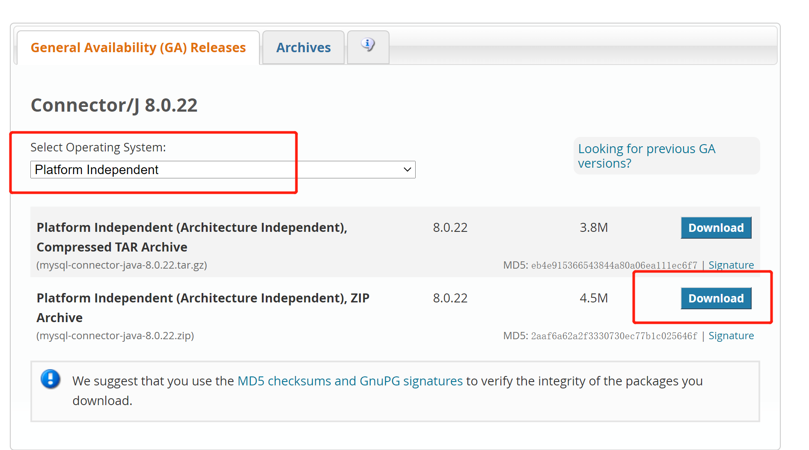

# JDBC

## 2020-12-07 使用JDBC

[使用参考](https://www.runoob.com/w3cnote/jdbc-use-guide.html)

-   JDBC和ODBC的区别
-   [文章参考](https://www.cnblogs.com/yaochc/p/5745281.html)

-   三层结构

    >关于三层架构的理解：可以和生活练习起来：

    >可以借鉴服务员，厨师，采购员之间的关系：

    >顾客直接和服务员打交道，顾客和服务员（UI层）说：我要一个炒茄子，而服务员不负责炒茄子，她就把请求往上递交，传递给厨师（BLL层），厨师需要茄子，就把请求往上递交，传递给采购员（DAL层），采购员从仓库里取来茄子传回给厨师，厨师响应cookEggplant()方法，做好炒茄子后，又传回给服务员，服务员把茄子呈现给顾客。


- JDBC使用：
  [参考文章](https://blog.csdn.net/qq_36172505/article/details/84102468)

- JDBC中主要有以下四类对数据库进行管理
- 
    > DriverManager、Connection、Statement、ResultSet 

    >用来装载数据库驱动、进行数据库链接、进行sql语句的创建、得到查询结果集

-   加载驱动-链接驱动-Sql语言-关闭操作-关闭数据库链接
1. 要先下载对应的mysql-connector-java包，并解压好
   
   [jar下载地址](https://dev.mysql.com/downloads/connector/j/)
   

2. 在创建的Java项目中添加依赖包
   

3. 测试代码

```java
    //导入包
    import java.sql.Connection;
    import java.sql.DriverManager;
    import java.sql.ResultSet;
    import java.sql.SQLException;
    import java.sql.Statement;

    /*
    * 数据库连接
    */
    public class Conn {
        public static void main(String[] args) {
            Connection con;
            //jdbc驱动
            String driver="com.mysql.cj.jdbc.Driver";
            //这里应该选择自己的数据库
            String url="jdbc:mysql://localhost:3306/mysql";
            String user="root";
            String password="123456";
            try {
                //注册JDBC驱动程序
                Class.forName(driver);
                //建立连接
                con = DriverManager.getConnection(url, user, password);
                if (!con.isClosed()) {
                    System.out.println("数据库连接成功");
                }
                con.close();
            } catch (ClassNotFoundException e) {
                System.out.println("数据库驱动没有安装");

            } catch (SQLException e) {
                e.printStackTrace();
                System.out.println("数据库连接失败");
            }
        }
    }
```

- mysql_java驱动已经更改成：com.mysql.cj.jdbc.Driver
- 老版本可以用：com.mysql.jdbc.Driver

**详细的增删改查操作**

[参考链接](https://www.cnblogs.com/panchanggui/p/9672252.html)


-   主要通过jdbc建立一个链接，得到这个conn，然后通过这个链接创建一个stmt语句（包括预处理和正式），该stmt绑定了几个
    操作函数，例如：update函数可以执行sql语言的insert、update、delete操作，query单独执行对应的查询select操作。

```java
    package com.cnjc.db;

    import java.sql.*;

    public class jdbc {
        //定义MySQL的数据库驱动程序
        public static final String DBDRIVER = "com.mysql.cj.jdbc.Driver";
        //定义MySQL数据库的连接地址
        public static final String DBURL = "jdbc:mysql://localhost:3306/test";
        //MySQL数据库的连接用户名
        public static final String DBUSER = "root";
        //MySQL数据库的连接密码
        public static final String DBPASS = "123456";
        public static void main(String[] args) {
            Connection con = null;
            Statement stmt = null;
            //数据库插入语句
            String insertSQL = "insert into tb_01 (runoob_title,runoob_author,submission_date) values (\"学习C\",\"菜鸟教程\",NOW());";
            //数据库修改语句
            String alterSQL = "update tb_01 SET runoob_author='菜鸟教程' where runoob_id=5";
            //数据库删除语句
            String deleteSQL = "delete from tb_01 where runoob_title='学习C' ";
            //数据库查询语句
            String querySQL = "select * from tb_01";
            try {
                //加载驱动程序
                Class.forName(DBDRIVER);
            }
            catch (ClassNotFoundException e) {
                e.printStackTrace();
            }
            try {
                //连接MySQL数据库时，要写上连接的用户名和密码
                con = DriverManager.getConnection(DBURL, DBUSER, DBPASS);
                //实例化Statement对象
                stmt = con.createStatement();
                //执行数据库更新操作
                stmt.executeUpdate(insertSQL);
                stmt.executeUpdate(alterSQL);
                stmt.executeUpdate(deleteSQL);
                ResultSet rs =stmt.executeQuery(querySQL);
                while (rs.next()){
                    int id = rs.getInt("runoob_id");
                    String title = rs.getString(2); // 使用列名也可以，使用返回的第几个参数也可以
                    String author = rs.getString(3);
                    String date = rs.getString(4);
                    System.out.println(id+ title + author + date);

                }
            }
            catch (SQLException e) {
                e.printStackTrace();
            }
            System.out.println(con);
            try {
                //关闭操作
                stmt.close();
                //关闭数据库
                con.close();
            }
            catch (SQLException e) {
                e.printStackTrace();
            }
        }
    }
```
