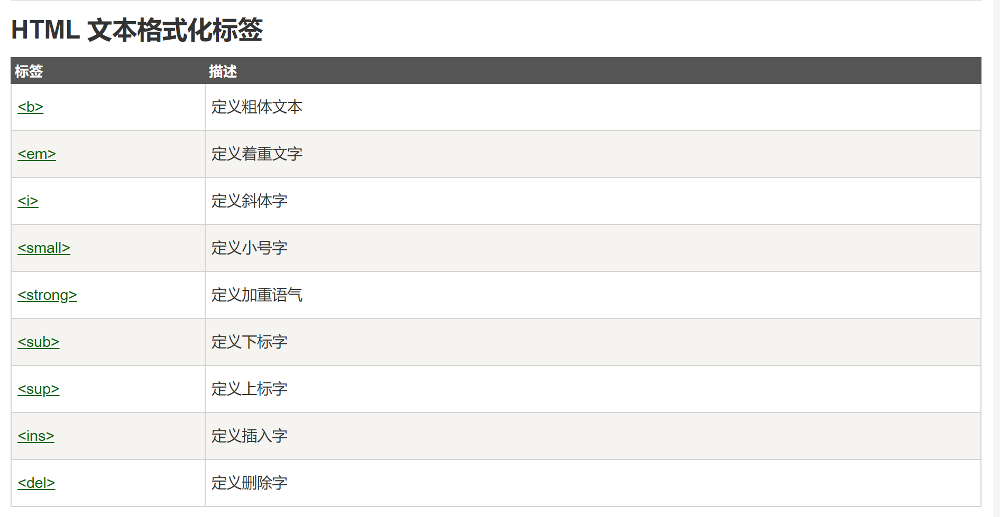
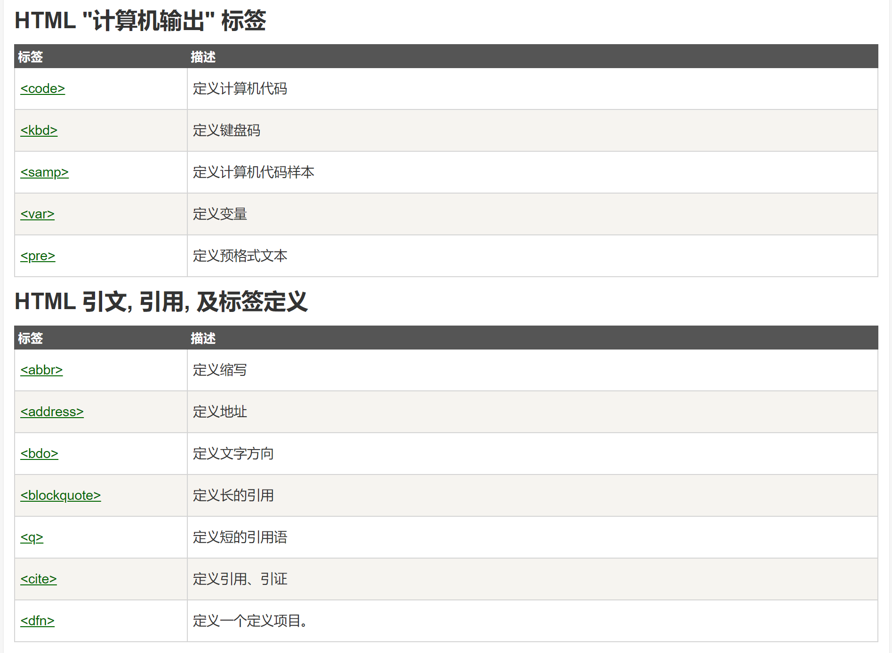

# HTML
-   超文本标记语言（HyperText Markup Language）
-   [cnjc](https://www.runoob.com/html/html-tutorial.html)
-   htm和html建议使用html
    >前者是超文本标记(Hypertext Markup)

    >后者是超文本标记语言(Hypertext Markup Language)

    >可以说 htm = html
- Eg
  
```html
    <!DOCTYPE html>
    <html>
    <head>
    <meta charset="utf-8">
    <title>菜鸟教程(runoob.com)</title>
    </head>
    <body>
    
    <h1>我的第一个标题</h1>
    
    <p>我的第一个段落。</p>
    
    </body>
    </html>
```
-   解析
```html
    <!DOCTYPE html> 声明为 HTML5 文档
    <html> 元素是 HTML 页面的根元素
    <head> 元素包含了文档的元（meta）数据，如 <meta charset="utf-8"> 定义网页编码格式为 utf-8。
    <title> 元素描述了文档的标题
    <body> 元素包含了可见的页面内容
    <h1> 元素定义一个大标题
    <p> 元素定义一个段落
```

### 编辑器：VS Code


### tag介绍

-   定义文档`<html>`
-   定义文档的主题`<body>`

-   标题
```html
    <h1>这是一个标题</h1>
    <h2>这是一个标题</h2>
    <h3>这是一个标题</h3>
```

-   段落
```html
    <p>这是一个段落。</p>
    <p>这是另外一个段落。</p>
```

-   链接
```html
    <a href="https://www.runoob.com">这是一个链接</a>
```

-   图像
```html
    
```
-   换行 `<br>`
-   水平线`<hr>`
-   注释`<!--这是一个注释-->`
-   文件格式化内容
    
    
-   颜色渲染`<p style="color:blue;margin-left:20px;">这是一个段落。</p>`
```html
    <body style="background-color:yellow;">
    <h2 style="background-color:red;">这是一个标题</h2>
    <p style="background-color:green;">这是一个段落。</p>
    </body>
```

-   补充
```html
    1、*.html 文件跟 *.jpg 文件(f盘)在不同目录下：

    
    2、*.html 文件跟 *.jpg 图片在相同目录下：

    3、*.html 文件跟 *.jpg 图片在不同目录下：
    a、图片 *.jpg 在 image 文件夹中，*.html 跟 image 在同一目录下：

    
    b、图片 *.jpg 在 image 文件夹中，*.html 在 connage 文件夹中，image 跟 connage 在同一目录下：

    
    4、如果图片来源于网络，那么写绝对路径：

    
```