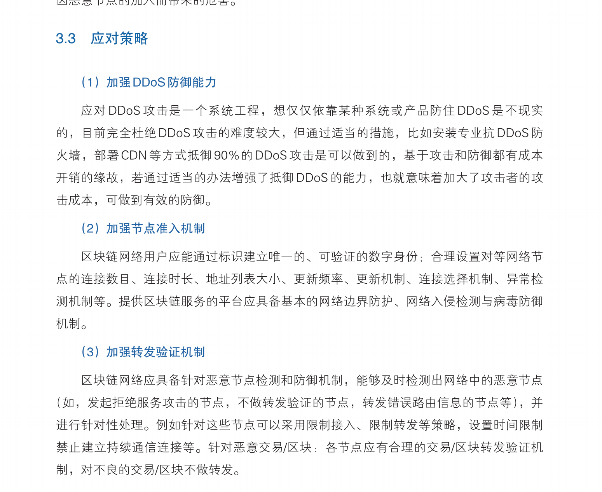

# 时间：2021.05.14 上午

----

## 基础知识

    1. ping操作的使用和原理？
        答：ping是一个通信协议，是TCP/IP的子协议，命令可以检查网络是否联通，能够帮助我们分析和判定网络故障。

        ping命令整个过程详解，主要分两种情况：1.同一个网段内；2.不同的网段内。

        1.1 同一个网段内（IP序列前缀是一样的）：ARP协议
        依靠的是ARP（Address Resolution Protocol）地址解析协议，A主机向同一个网段的B主机进行交互，首先会检查本地的MAC表寻找B主机的MAC，如果没有则会向交换机发送ARP相应，寻找B主机的MAC地址，如果交换机有则直接返回B的MAC地址给A，反之，则向所有端口发布ARP广播，进行查找，各主机收到信息进行判定，如果是自己的MAC则返回给交换机同时返回给A主机，如果不是自己的，则丢弃。
        1.2 不同的网段间：ICMP协议
        ICMP（Internet Control Message Protocol）是TCP/IP协议簇的一个子协议，用于在IP主机、路由器之间传递控制消息。控制消息是指网络通不通、主机是否可达、路由是否可用等网络本身的消息。
        如果主机A要ping主机C，那么主机A发现主机C的IP和自己不是同一网段，他就去找网关转发，但是他也不知道网关的MAC地址情况下呢？他就会向之前那个步骤一样先发送一个ARP广播，学到网关的MAC地址，再发封装ICMP报文给网关路由器，再次进行查找，直到找到为止。

    2. ping底层使用的具体协议？（网络层）
        答：大的协议主要是TCP/IP协议，TCP是传输层的可靠连接协议（三次握手），IP是网络层的协议，具体的就是ARP协议和ICMP协议，用于在IP主机、 路由器之间传递控制消息，也会用到DNS协议，主要是进行域名和IP地址的转化。

[TCP/IP详解](https://www.huaweicloud.com/articles/8b7799c3bc64b54e79db3b8603ad5a12.html)

[cookie和session的区别详解](https://www.cnblogs.com/shiyangxt/articles/1305506.html)

    3. RPC与gRPC的不同？包括底层协议？
        答：RPC，远程过程调用(Remote Procedure Call)，服务调用者可以像调用本地接口一样调用远程的服务提供者，而不需要关心底层通信细节和调用过程。
        gRPC，是一个高性能、开源、通用的RPC框架。基于HTTP/2协议标准设计开发，默认采用Protocol Buffers数据序列化协议Protocol Buffers基本语法，支持多种开发语言。gRPC提供了一种简单的方法来精确的定义服务，并且为客户端和服务端自动生成可靠的功能库。

    4. https与http的区别？https是如何实现加密的？
        答：http属于应用层协议
        http：超文本传输协议HTTP协议被用于在Web浏览器和网站服务器之间传递信息，HTTP协议以明文方式发送内容，不提供任何方式的数据加密，如果攻击者截取了Web浏览器和网站服务器之间的传输报文，就可以直接读懂其中的信息，因此，HTTP协议不适合传输一些敏感信息，比如：信用卡号、密码等支付信息。

        https：安全套接字层超文本传输协议，为了数据传输的安全，HTTPS在HTTP的基础上加入了SSL协议，SSL依靠证书来验证服务器的身份，并为浏览器和服务器之间的通信加密。

        https的优点：
        （1）使用HTTPS协议可认证用户和服务器，确保数据发送到正确的客户机和服务器；
        （2）HTTPS协议是由SSL+HTTP协议构建的可进行加密传输、身份认证的网络协议，要比http协议安全，可防止数据在传输过程中不被窃取、改变，确保数据的完整性。
        （3）HTTPS是现行架构下最安全的解决方案，虽然不是绝对安全，但它大幅增加了中间人攻击的成本。

        https的缺点：
        （1）HTTPS协议握手阶段比较费时，会使页面的加载时间延长近50%，增加10%到20%的耗电；
        （2）HTTPS连接缓存不如HTTP高效，会增加数据开销和功耗，甚至已有的安全措施也会因此而受到影响；
        （3）SSL证书需要钱，功能越强大的证书费用越高，个人网站、小网站没有必要一般不会用。
        （4）SSL证书通常需要绑定IP，不能在同一IP上绑定多个域名，IPv4资源不可能支撑这个消耗。
        （5）HTTPS协议的加密范围也比较有限，在黑客攻击、拒绝服务攻击、服务器劫持等方面几乎起不到什么作用。最关键的，SSL证书的信用链体系并不安全，特别是在某些国家可以控制CA根证书的情况下，中间人攻击一样可行。

    5. 在分布式系统交互的时候，如果发生了网络不可达错误，如何寻找到对应位置？
        答：
    
    6. 网络攻击的应对方式？
        答：DDOS攻击，它在短时间内发起大量请求，耗尽服务器的资源，无法响应正常的访问，造成网站实质下线。 DDOS里面的DOS 是denial of service（停止服务）的缩写，表示这种攻击的目的，就是使得服务中断。
            防止：隐藏真实的服务器IP、关闭不必要的服务减少无效的端口、限制SYN/ICMP，提升带宽
            中间人攻击：攻击者可将自身插入访客的设备与网络之间。在不知情的情况下，访客的所有信息都会经由攻击者传输。
            防止：使用HTTPS协议

----

## 区块链项目工程问题

    1. 为什么要选择国密算法？
   [链接](https://zhuanlan.zhihu.com/p/132352160)
        答：国密算法是国际密码据认定的国产密码算法，主要有：SM1、SM2、SM3、SM4，密钥长度和分组长度都是128位
        SM1为对称加密与DES同种类型
        SM2非对称加密与RSA同种类型
            SM2-1 椭圆曲线数字签名算法，实现数字签名
            SM2-2 椭圆曲线密钥交换协议，密钥协商
            SM2-3 椭圆曲线公钥加密算法，数据加密
            相对于RSA算法，SM2是基于椭圆曲线上点群 离散对数 难题，256位的SM2密码强度比2048位的RSA强度高
        SM3消息摘要和MD5-128 bit、SHA-1 160 bit、SHA-2 （SHA-256）256 bit一样的效果，但是SHA-256耗时要高
            适用于商用密码应用中的数字签名和验证消息认证码的生成与验证以及随机数的生成
            为了保证杂凑算法的安全性，其产生的杂凑算法的长度不应太短
            MD5只有128bit，SHA-1只有160bit，SM3算法的安全性要高于这两类算法

        SM4 无线局域网的分组数据算法，对称加密，128 bit

    2. fabric的多通道具体指的是？
        答：HyperLedger 1.0中，增加了多链实现
        链：是由一个通道+一个共享账本+N个节点组成，不同的链将参与者和数据进行隔离，真正实现了数据隔离，有效保护了隐私数据，提高了并行的效率。
        Q&A：
        多通道的应用场景？ 多个不同的行业、不同组织、数据隐私的不同访问策略等等
        一个peer节点对应一个账本吗？ 不一定，这需要考虑peer节点加入了几个应用通道，部署了几个链码

    3. Fabric的共识流程？ “执行-排序-验证”
        答：执行一个交易并检查其正确性，从而给它背书；通过可插拔式的共识协议将交易排序；提交交易账本到前先根据特定应用程序的背书策略验证交易。
            交易可以分为两类，一类是查询交易，单节点就可以完成；另一类是更新交易，需要进行排序共识。
        一共有三个阶段：提议阶段(背书节点)、打包阶段（排序）、验证阶段（同步到本地帐本）

        ClientA 初始化一个交易：提出交易请求---构建交易Proposal（调用Chaincode），主要是利用SDK中间件，将交易打包为合适的架构格式（通过gRPC的协议缓冲区），并采用用户的加密凭证为该交易建议生成唯一的签名

        Endorsing peers验证签名并执行交易：提交Proposal的组织正确性、交易是否被提交、用户签名的合法性、提交者所进行的操作，生成一个预执行结果，当时并不更新账本数据，将结果返回给SDK

        Proposal回应被检查：验证Endorsing返回的结果是否符合对应的预期和结果

        Client将背书结果装配到交易中：应用程序将交易信息中的交易proposal和相应广播到排序节点，包括读写集、被承认的peer签名和channelID。 排序节点并不会读取交易的详细信息，只是从网络中接受所有的交易，根据channel的时间进行排序，并为每个渠道创建交易块

        交易被验证并提交：交易被传递到channel上的所有peer，块内交易被验证并查看结果集

        账本更新：每个peer将块附加到channel的链，并且对于每个有效交易，write集被提交到当前的状态数据库，返回结果给客户端成功与否。

            
    4. DHT环解决的问题是？
        答：共识的效率问题，达到更快的共识

    5. 区块链节点之间交互，如何防止网络攻击？
        答：女巫攻击：攻击者通过伪造的身份，使少量节点伪装成大量节点，进而影响整个网络。攻击者可能利用女巫攻击进行双花、实现51%攻击等，并且要实施日蚀攻击，一般都会先进行女巫攻击。
            日食攻击：将单节点从独立的网络中孤立出来，进行无效的交易

----

## 数据库项目工程问题

    1. Sql大量的Injection攻击如何防止？
   [链接](https://www.jianshu.com/p/078df7a35671)

        答：Sql 注入攻击是通过将恶意的 Sql 查询或添加语句插入到应用的输入参数中，再在后台 Sql 服务器上解析执行进行的攻击，它目前黑客对数据库进行攻击的最常用手段之一。
            示例：猜测数据库、验证绕过、
            如何判断：单引号判断发
            判断是字符型还是数字型注入，1=1 or '1'='1'

    2. 区块链项目中是如何用到SQL语言的？
        答：需要储存历史交易信息，同时查询特定的交易，eg:etherscan.io 历史上所有的交易均可查询

    3. SQL的Index是如何实现的？
        答：

    4. Index有没有什么更好的方法？

    5. 如果Table的Metadata进行修改，底层的Key-Value如何操作？

----

## 算法题

    1. 给定一个整形数组，找出最长升序的最高效的方式？
        答：滑动窗口
