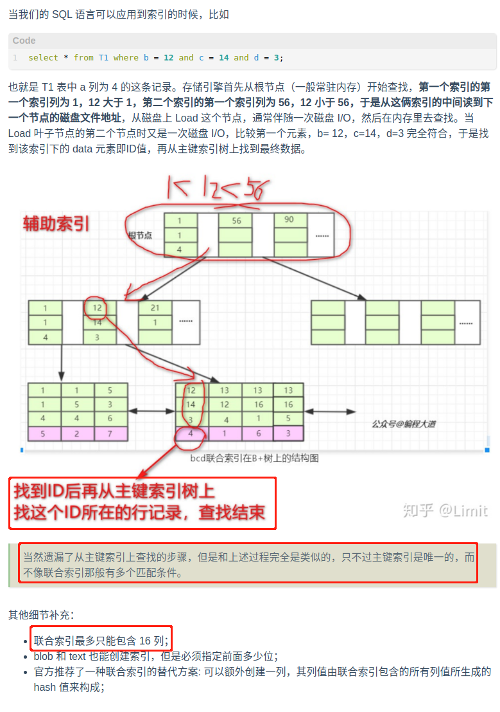

# B+树与Innodb 以及索引

---
[参考1-Innodb的大小计算](https://www.cnblogs.com/leefreeman/p/8315844.html)
[参考2-mysql-page大小](https://zhuanlan.zhihu.com/p/334684710)
[参考3-InnoDB的数据结构-数据页组织](https://segmentfault.com/a/1190000019321380)

[参考4-B+树索引](https://www.cnblogs.com/GrimMjx/p/10540263.html)
[参考5-辅助索引与主键索引](http://blog.codinglabs.org/articles/theory-of-mysql-index.html)
[参考6-复合/联合索引](https://www.jianshu.com/p/35588ecf33c1)

Innodb支持以下索引：
    
    B+树索引、全文索引、哈希索引

    哈希索引是自适应的，也就是说这个不是人为干预在一张表生成哈希索引，Innodb会根据这张表的是使用情况来自动生成
    
    全文索引是将存在数据库的整本书的任意内容的信息查找出来的技术，从1.2.x版本支持，每张表只能有一个全文检索的索引
    
    B+树索引是传统意义上的索引，B+树索引并不能根据键值找到具体的行数据，B+树索引只能找到行数据锁在的页，然后通过把页读到内存，
    再在内存中查找到行数据。B+树索引也是最常用的最为频繁使用的索引。

1、什么是B+树

    是一种平衡查找树，因为普通的二叉树可能因为插入的数据最后变成一个很长的链表，怎么能提高搜索的速度呢？（变成平衡书，提高查找性能）

    1、有n个子树的中间节点包含n个元素，每个元素不保存数据，只用来索引，所有的数据都保存在叶子结点
    2、所有的叶子节点包含元素的信息以及指向记录的指针，且叶子节点按关键字自小到大顺序链接
    3、所有的中间节点元素都同时存在于子节点，在子节点元素中是最大（或最小元素）。

    所有的数据都在叶子节点上，且每一个叶子节点都有一个只想下一个叶子节点的指针，行程了一个有序的链表。
    Q：为什要有序？其实是为了范围查找。

    优势：单一节点存储更多元素，减少IO；所有查询都要找到叶子节点，查询稳定；所有叶子节点形成有序链表，方便范围查找；

2、聚集索引和辅助索引

    聚集索引：是按照表的的主键构造的B+树，叶子节点存放的为整张表的行记录数据，每张表只能有一个聚集索引，优化器更倾向于采用聚集索引，
    直接可以获取行数据。
    
    对于每个叶子节点，都存有完整的行记录，对于主键查找速度相当的块

    辅助索引：辅助索引也叫非聚集索引，叶子节点除了键值以外还包含了一个bookmark，用来告诉InnoDB在哪里可以找到对应的行数据，
    InnoDB的辅助索引的bookmark就是相对应行数据的聚集索引键。也就是先获取指向主键索引的主键，然后通过主键索引来找到一个完整的行。
    如果辅助索引的树和聚集索引的树的高度都是3，如果不是走主键索引走辅助索引的话，那么需要6次逻辑IO访问得到最终的数据页。
    （先通过辅助索引的值（value就是对应的主键大小）找到主键索引，然后通过主键索引IO几次找到数据）

3、Innodb结构

    Linux：文件系统：

    
    操作系统是通过页表机制来实现进程的虚拟地址到物理地址的转化的，其中每一页的大小是固定的，为4k，一个扇区为512字节，一页为8个扇区

    InnoDB逻辑存储单元主要分为表空间、段、区、页。
    tablespace-》segment-》extent-》page。一个extent包含64个page

    假设一行数据的大小是1k，那么一个页可以存储16行数据。
    通过使用B+树的方式来组织这些数据，一个页大小为16k，约等于16384字节，每一个索引（本身类型+指针大小）大概有14字节，
    一页数据可以存放16384/14=1170个数据，高度为2的B+树，能存放1170*16=18720条数据记录，高度为3的B+树，能存放1170*1170*16
    =21902400条数据，已经是千万级别的数据存储，所以一般来说高度3就够用了。

    
4、Innodb数据页是如何组织的？
    
    数据库数据是存在磁盘中的，不过真正处理数据是在内存中进行的，这就需要从磁盘上不断地把数据读到内存中，由于内存和磁盘速度差
    几个数量级级别，所以为了避免频繁的数据交互带来的问题，mysql一次会多读取一些，是多少呢？
    读一页。一页有16kb，（这里就是按照Innodb的文件组织形式规定的大小，为16k）也就是说一次读取一般都是16kb的倍数。
    `页是磁盘内存交互的基本单位`

    一条记录称为：数据行。Innodb中有四种不同类型的数据行，Compact、Redundant、Dynamic、Compressed
    

    一张数据页内部结构，一个16kb的页，内部放着很多行，比如3条记录，除此之外，内部存放着两个特殊的记录，最大记录和最小记录
    
    数据页内部记录是以单链表的形式存放的，头围分别是那两个特殊的记录，在内存中有很多页，页和页之间是用双链表连接的
5、B+索引扩充：

        
    一般为了检索的快一点，我们主键都是自动生成的，所以最下面那层是根据id排序生成的，最下面那层的叶子节点是真实的数据。
    有4页，每页里面有一个单链表，就是我们的真实数据行。第二行有两页，每页中也是有个数据行构成的单链表，这是的数据行只
    包含了页码（最底下那层某页）、某页最大id，由此可见，第二行比最底下那行页数少了很多很多。就这样，一层一层的抽取，一
    定会有一个所谓的跟页。我们搜索数据就是从跟页开始的，一层一层往下找的。由于一个数据页可以存放16KB数据，所以三四层的
    树状图就已经能存放很多很多数据了，所以不要担心树会很深。再强调一下，页内是单链表，同层的页和页之间是双链表。

6、B+Tree 补充

    1、B+Tree的非叶子节点不保存关键字记录的指针，只进行数据索引（冗余，因为叶子节点上有着完整的索引结构）。这样使得B+树每个非叶子节点所能保存的
        索引值大大增加；
    2、B+ 树叶子节点保存了父节点的所有关键字记录的指针，所有数据地址必须要到叶子节点才能获取到。所以每次数据查询的次数都一样；
    3、B+ 树叶子节点的关键字从小到大有序排列，左边结尾数据都会保存右边节点开始数据的指针。（主要是进行范围查找）
    4、B+树的层级更少：相较于B树B+每个非叶子节点存储的关键字数更多，树的层级更少所以查询数据更快；
    5、B+树查询速度更稳定：B+所有关键字数据地址都存在叶子节点上，即每一个索引实际上距离根节点距离相同，所以每次查找的次数都相同所以查询速度要比
        B树更稳定;
    6、B+树天然具备排序功能：B+树所有的叶子节点数据构成了一个有序链表，在查询大小区间的数据时候更方便，数据紧密性很高，缓存的命中率也会比B树高。
    7、B+树全节点遍历更快：B+ 树遍历整棵树只需要遍历所有的叶子节点即可，，而不需要像 B 树一样需要对每一层进行遍历，这有利于数据库做全表扫描。
    8、B+ 树的范围查找非常方便，这是因为 B+ 树的叶子节点之间依靠单向指针相连。比如查找范围为 10<index<16 的节点，我们仅仅需要先找到索引为10的
    9、节点在哪个叶子子节点上，特别需要指出的是，即使比如 14 节点在另一个叶子节点上，也能通过叶子节点之间的指针快速找到索引。

    `B树相对于B+树的优点是：`如果经常访问的数据离根节点很近，而B树的非叶子节点本身存有关键字其数据的地址，所以这种数据检索的时候会要比B+树快。

7、MyISAM VS InnoDB

    InnoDB将表单数据和索引用一颗B+Tree来表示，因此称为聚集（聚族索引）；
    MyISAM将表单数据和索引分开两个文件来存储，因此就没有上述说法；

    在 MySQL 中，索引属于存储引擎级别的概念，不同存储引擎对索引的实现方式是不同的，本文主要讨论 MyISAM 和 InnoDB 两个存储引擎的索引实现方式。
    不管哪一个存储引擎，都是描述一个表。虽然一个数据库通常有其默认的存储引擎设置。

    7.1、MyISAM中的B+Tree
    
        MyISAM 引擎使用 B+Tree 作为索引结构，叶节点的 data 域存放的是数据记录的地址。下图是 MyISAM 索引的原理图：

        从上图也可以看出，表单存储文件和索引存储是分开独立存储的。
        这里设表一共有三列，假设我们以 Col1 为主键，则是一个 MyISAM 表的主索引（Primary key）示意。可以看出 MyISAM 的索引文件仅仅
        保存数据记录的地址。在 MyISAM 中，主索引和辅助索引（Secondary key）在结构上没有任何区别，只是主索引要求 key 是唯一的，而辅助索引的
        key 可以重复。如果我们在 Col2 上建立一个辅助索引，则此索引的结构如下图所示：

        同样也是一棵 B+Tree，data 域保存数据记录的地址。因此，MyISAM 中索引检索的算法为首先按照 B+Tree 搜索算法搜索索引，如果指定的 Key
        存在，则取出其 data 域的值，然后以 data 域的值为地址，读取相应数据记录。
        MyISAM 的索引方式也叫做“非聚集”的，之所以这么称呼是为了与 InnoDB 的聚集索引区分。

    7.2、InnoDB中的B+Tree
        
        虽然 InnoDB 也使用 B+Tree 作为索引结构，但具体实现方式却与 MyISAM 截然不同。

        第一个重大区别是 InnoDB 的数据文件本身就是索引文件。从上文知道，MyISAM 索引文件和数据文件是分离的，索引文件仅保存数据记录的地址。
        而在InnoDB中，表数据文件本身就是按 B+Tree 组织的一个索引结构，这棵树的叶节点 data 域保存了完整的数据记录。这个索引的 key 
        是数据表的主键，因此 InnoDB 表数据文件本身就是主索引。

        上图是 InnoDB 主索引（同时也是数据文件）的示意图，可以看到叶节点包含了完整的数据记录。这种索引叫做聚集索引。因为 InnoDB 的数据文件本
        身要按主键聚集，所以 InnoDB 要求表必须有主键（MyISAM 可以没有），如果没有显式指定，则 MySQL 系统会自动选择一个可以唯一标识数据记录
        的列作为主键，如果不存在这种列，则 MySQL 自动为 InnoDB 表生成一个隐含字段作为主键，这个字段长度为 6 个字节，类型为长整形。

    7.3、辅助索引

        与MyISAM索引的不同是InnoDB的辅助索引data域存储相应记录主键的值而不是地址。换句话说，InnoDB的所有辅助索引都引用主键作为data域。

        聚集索引这种实现方式使得按主键的搜索十分高效，但是辅助索引搜索需要检索两遍索引：首先检索辅助索引获得主键，然后用主键到主索引中检索获得记录。

    7.4、联合索引
        
        在上文中，我们都是假设索引只引用了单个的列，实际上，MySQL 中的索引可以以一定顺序引用多个列，这种索引叫做联合索引，一般的，一个联合索引是
        一个有序元组<a1, a2, …, an>，其中各个元素均为数据表的一列，实际上要严格定义索引需要用到关系代数，但是这里我不想讨论太多关系代数的话题，
        因为那样会显得很枯燥，所以这里就不再做严格定义。另外，单列索引可以看成联合索引元素数为 1 的特例。

        那么联合索引到底长什么样子？（基于InnoDB）
        假设：表 T1 有字段 a,b,c,d,e，其中 a 是主键，除 e 为 varchar 其余为 int 类型，并创建了一个联合索引 idx_t1_bcd(b,c,d)，然后 
        b、c、d 三列作为联合索引。

        联合索引结构：

        联合索引：联合索引的所有索引列都出现在索引数上，并依次比较三列的大小。
        非叶子节点里仅仅负责按索引声明的顺序存储联合的各个索引值：比如这里的 b、c、d，它们还拥有相关指针，指向下一层节点；
        叶子节点除了存储上述的索引值之外，还会存储 data，这里的 data 值的主键索引值；
            MySQL 的 InnoDB 天然有一个主键索引来作为表的内部实现，联合索引作为辅助索引，实际上辅助索引的 data 都是主键索引的值。而对于 
            MyISAM 其叶子节点中的 data 则是指向主题数据在 .myd 文件中的地址。
        关于排序：索引声明顺序为 (b,c,d) 因此顺序是升序，排序方式是先比较 b 再比较 c 最后比较 d，如果任意已经是不同了，那么就直接退出比较的迭代。

    7.5、联合索引的工作方式

    7.6、聚簇索引、覆盖索引、重复索引、冗余索引

[连接-索引的具体讲解](https://spongecaptain.cool/post/mysql/mysqlindexsummary/)