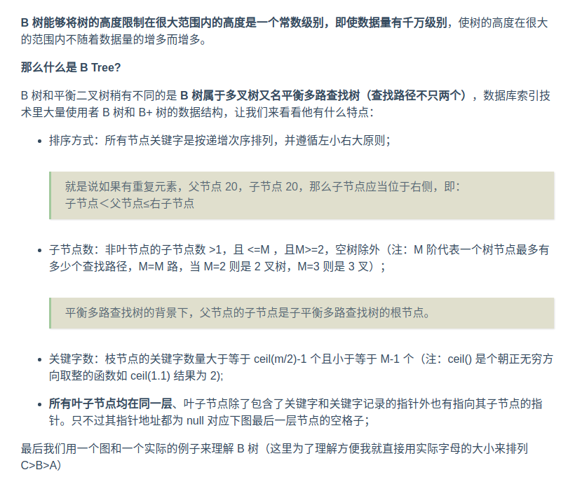
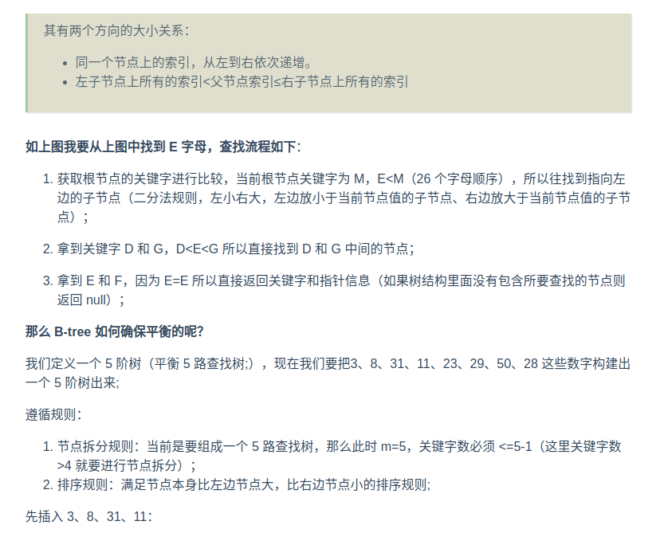
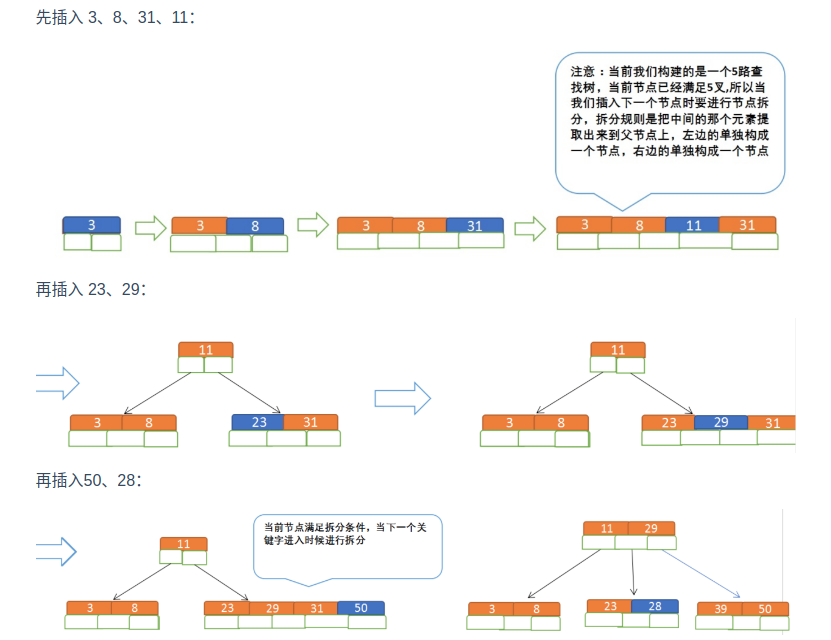

# B-Tree

---

B 树的特点：

    B 树相对于平衡二叉树的不同是，每个节点包含的关键字增多了，特别是在 B 树应用到数据库中的时候，数据库充分利用了磁盘块的原理（磁盘数据存储是采用
    块的形式存储的，每个块的大小为 4K，每次 I/O 进行数据读取时，同一个磁盘块的数据可以一次性读取出来）把节点大小限制和充分使用在磁盘块大小范围；
    把树的节点关键字增多后树的层级比原来的二叉树少了，减少数据查找的次数和复杂度；