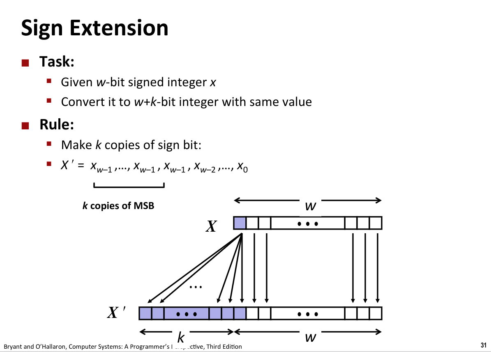

# 01-Overview & 02-Bits,Bytes,and Integers

---
[Book](https://csapp.cs.cmu.edu/)

1、建立操作系统或是微处理器设计
2、二进制计算
2.1 如果在表达式中进行混合计算（有符号与无符号），会统一转化为无符号进行运算，比较的时候可能会有惊喜
  
2.2 位二进制左移结果变成两倍
    
3、
```C++
    
   unsign = i
   for (i=n-1;n>=0;i--)
   // sizeof(j) 返回的结果也是无符号的数据
   // 会无限循环下去 
```

4、扩展（有无符号操作都一样）：将一个w bit的二进制数X扩展到w+k bit的二进制数据，将最高位的符号位复制即可
  
5、截断（无符号）：原结果mod当前最高位的幂即可。有符号，无固定规则(???有争议)

6、 字节顺序：仅对于整形数据有用，如果数据是字符串类型，无大小端区别，采用的方式都是一样的
    
    大端模式：是指数据的高字节保存在内存的低地址中，而数据的低字节保存在内存的高地址中
    
    小端模式，是指数据的高字节保存在内存的高地址中，而数据的低字节保存在内存的低地址中
7、 二进制的加减乘除
7.1 无符号类型加法：s = Uadd(u,v) = u + v mod 2^w   会产生断崖式跌落（会发生截断从w bit开始）
    有符号类型加减法：负数的加法是将其转化为补码进行计算的，就结果而言，无任何影响
    
    s = (int) ((unsigned) u + (unsigned) v);
    
    t = u + v       result: s==t (会产生溢出)

7.2 乘法，左移2^x bit；除法： 右移2^x bit

