# 03-Floating Point
---

1、浮点数按照小数点左侧右侧数据分开存储
    
    左侧是2^x (x为正值) 右侧是2^x (x为负值)，也就是1/2 1/4 1/8 ... 1/2^w
    
    乘除法也符合左移乘以2、右移除以2的操作，`limit` 但是仅仅只能表示2的倍数操作，类似于1/3 1/5 1/10表示不了

2、IEEE标准：1985年提出：

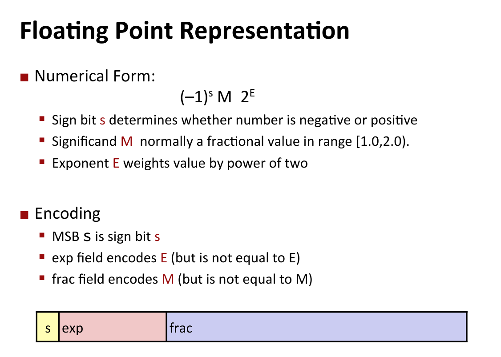
    s ： 符号位；    M 是尾部数据；    E 是2的指数。    
    
`以下按照64 bit 说明：`
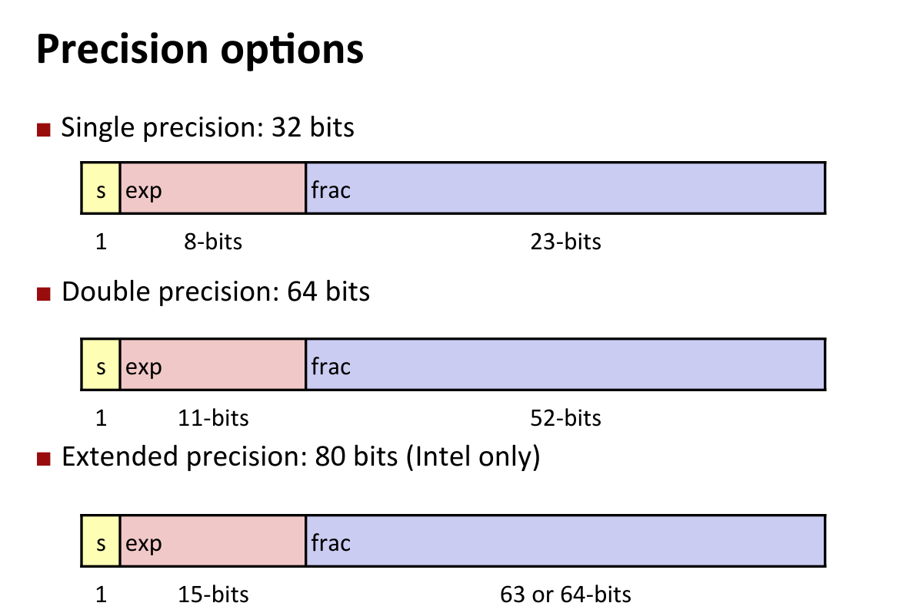

3、标准化数据的计算方式：

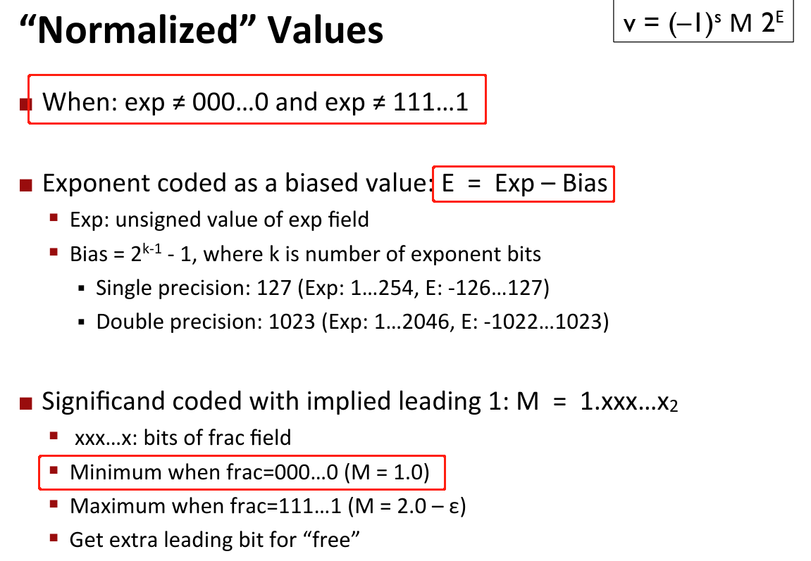

    E = Exp-Bias(条件是exp不全是0或不全是1，偏移量的取值表示更容易取得中间值)

    frac计算的时候前面默认存在1,尾部的数据处理时记得加1

4、Example：`32 bit`

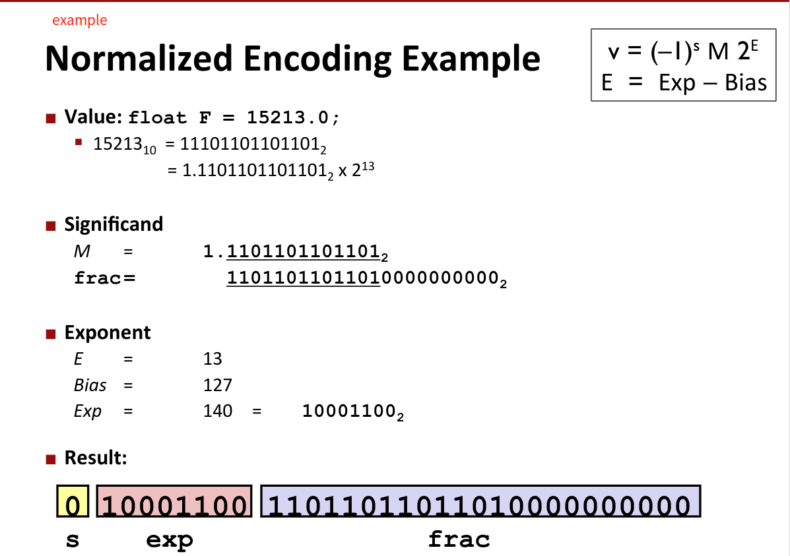

5、对于非标准化的数据计算方式：即exp全部为0，`E = 1 - Bias`

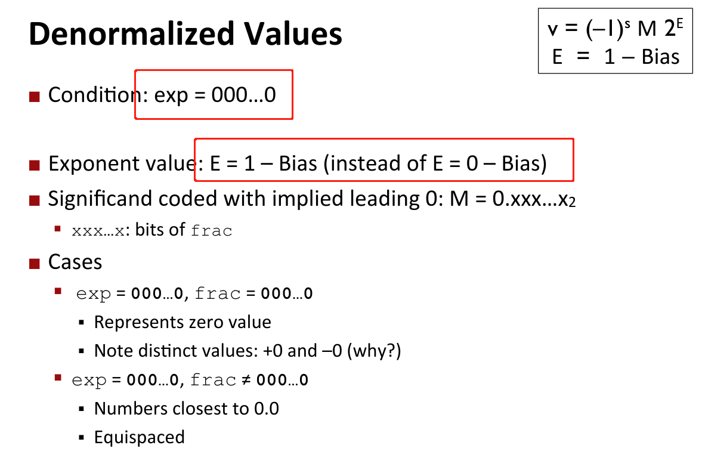

6、一些特殊值得计算：即exp全部为1

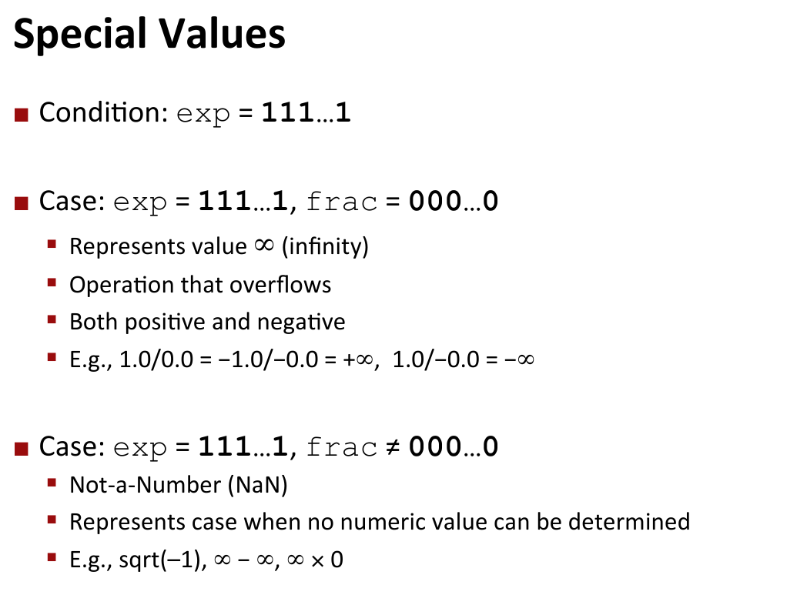

7、Example：

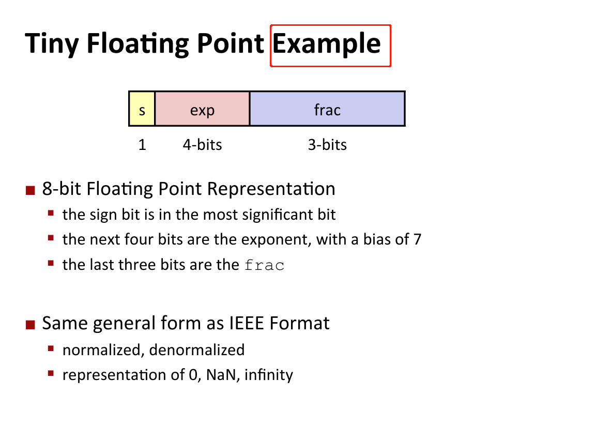

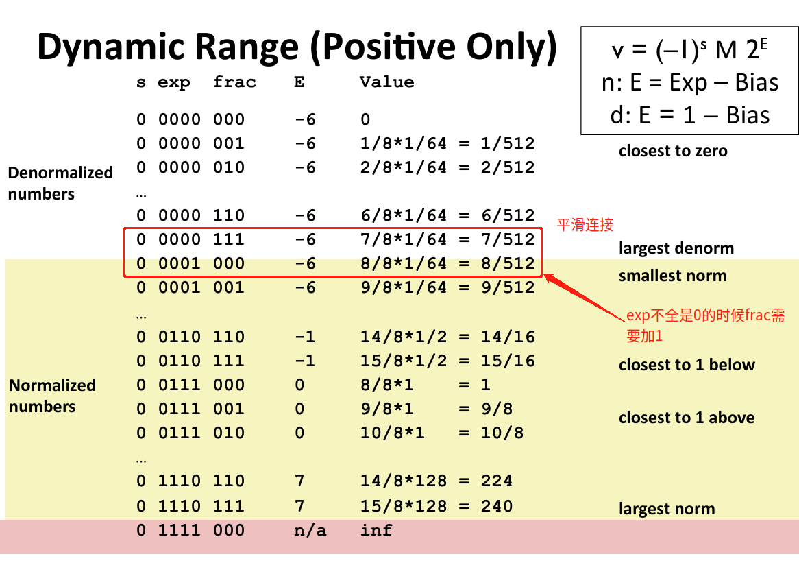

8、浮点数的舍入方式：`特别注意第四种向偶数取整，寻找中间值`

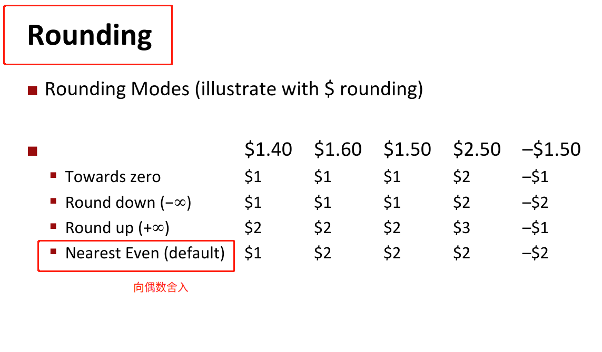

9、浮点数的乘法：`存在溢出情况`

10、浮点数不满足结合律：`中间小的数据会在保存时将其舍去`

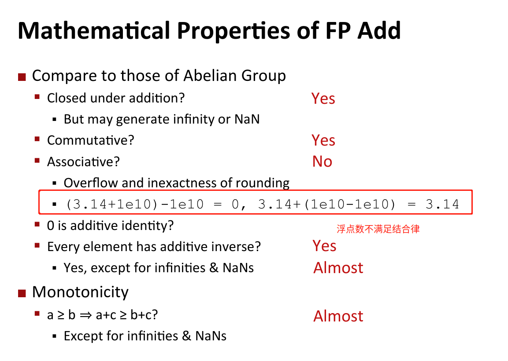

11、简单的计算：

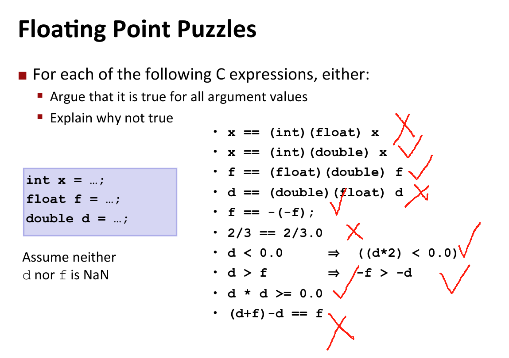
