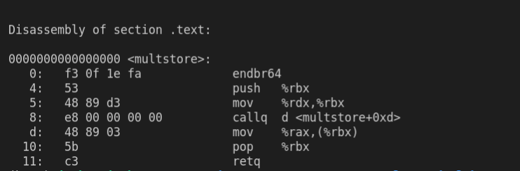

# 05-Machine-basics
---
1、两种形式的机器程序：
    
    一个是在计算机上运行的实际目标代码（字节代码），或者称之为（机器代码）汇编代码

    
2、 程序的各个过程：

    C预处理器扩展源代码——》编译器产生汇编代码（目标代码）——》链接器将目标代码与实现库函数的代码进行合并，产生可执行代码

    example:
```cgo
// file name : mstore.c
long mult2(long,long);

void multstore(long x , long y,long *dest){
    long t = mult2(x,y);
    *dest = t;
}
```
    linux> gcc -Og -S mstore.c

    产生汇编代码也就是对应的目标代码,每一行对应于一条机器指令

    linux> gcc -Og -c mstore.c

    会产生目标代码文件是mstore.o 二进制格式的文件，无法直接查看

    机器执行的程序只是一个字节序列，它是对一系列指令的编码，机器对产生这些指令的源代码几乎一无所知

    
`可以使用反汇编器进行查看`
    
    linux> objdump -d mstore.o 


