# 07-machine-control

---
到目前为止：只考虑了直线代码的行为，也就是指令一条接着一条顺序地执行，本章主要考虑条件语句、循环语句、分支语句
要求有条件的执行，根据数据测试的结果来决定操作执行的顺序

---

1、条件码：
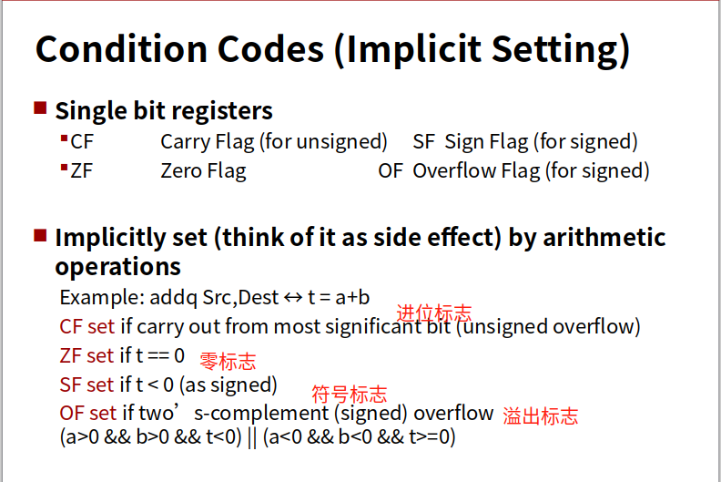

2、访问条件码：
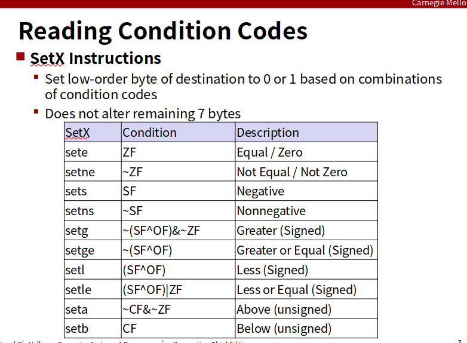
    
    set的指令的作用是将单个寄存器的单个字节设置为0或1

    16个寄存器都可以直接将其最低位设置为0或者1,不影响其它7个字节的使用

3、跳转指令：
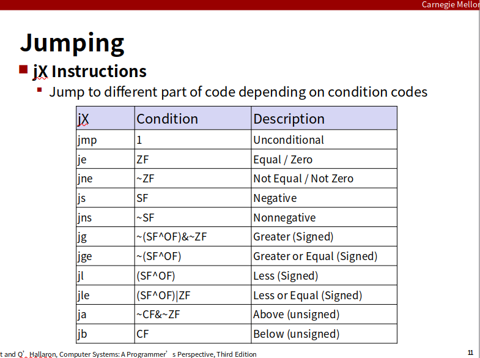

4、do-while循环：
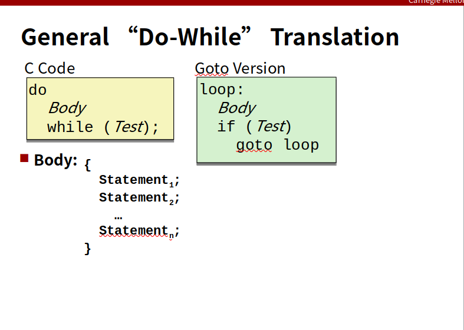

```c
do
    body-statement
    while(test-expr)
```
转化为goto语句：
```c
loop:
    body-statement
    t = test-expr;
    if(t)
        goto loop;
```
Example:
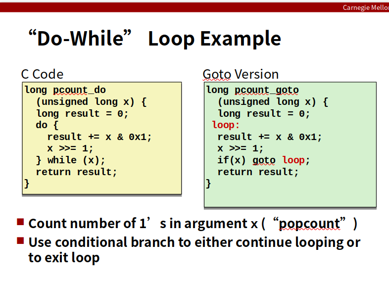

Compilation:
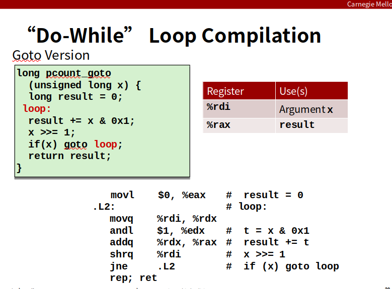


5、while循环：有两种翻译方式
第一种编译方式：跳转到中间，执行一个无条件跳转跳到循环结尾处的测试，以此来执行初始的测试

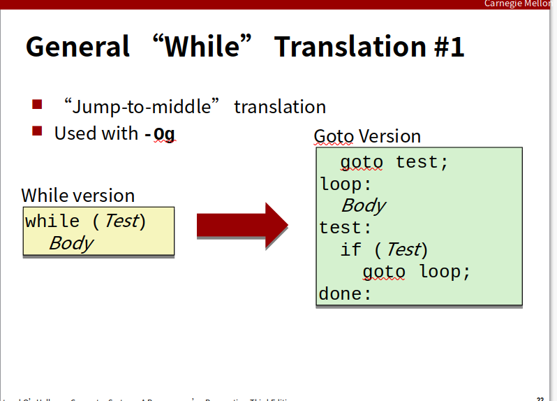

Example:
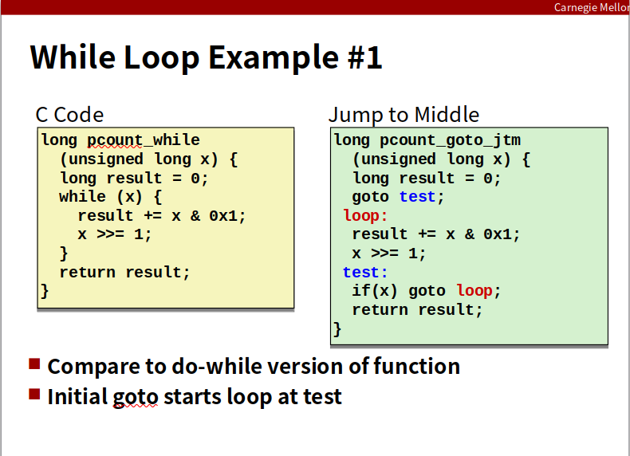

第二种编译方式：guarded-do，首先使用条件分支，如果条件不成立就跳出循环
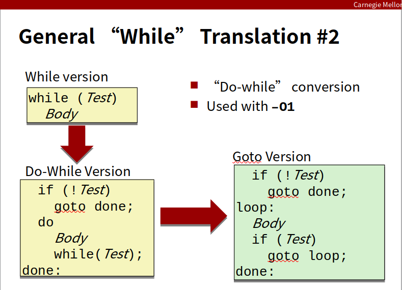

Example:
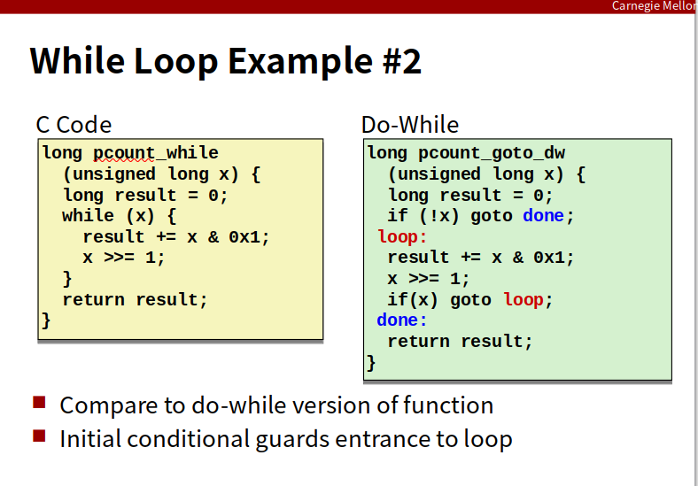

6、for循环

Form：
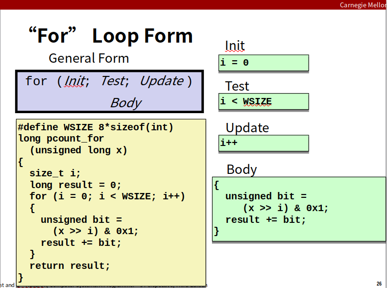

转换为while循环：
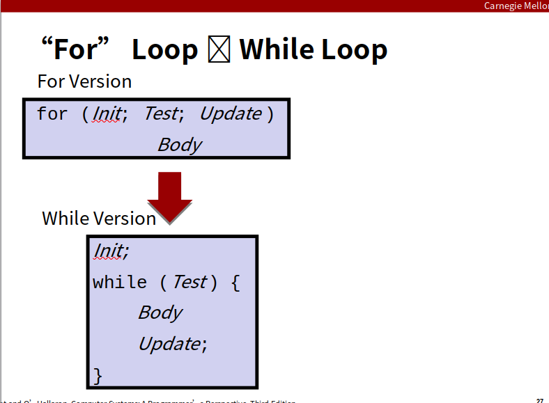

!需要注意的是：如果for循环中使用continue语句，则需要添加goto语句，否则可能陷入无限循环（CSAPP-P159）

7、switch语句：主要是通过创建一个跳转表实现的

Example：
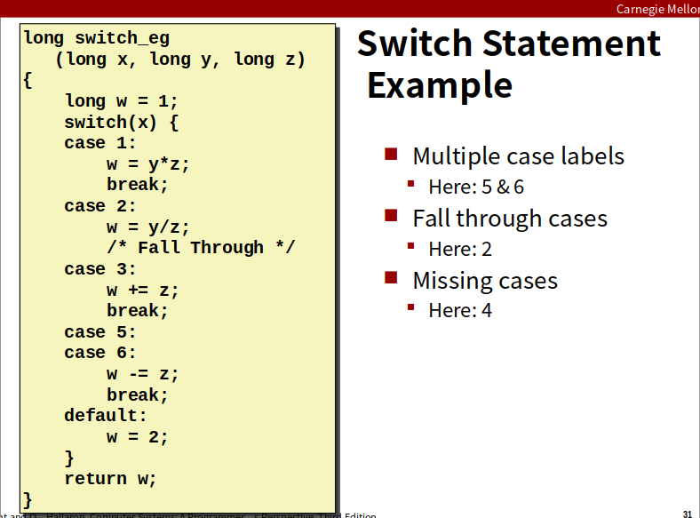

Jump Table:使用索引的时候存在优化（CSAPP-P161）
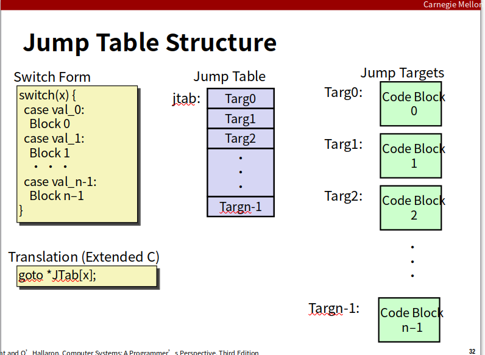


