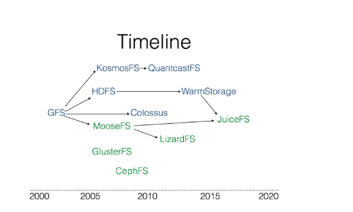
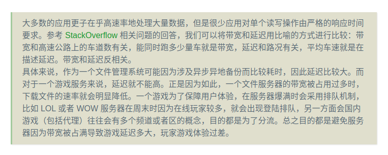
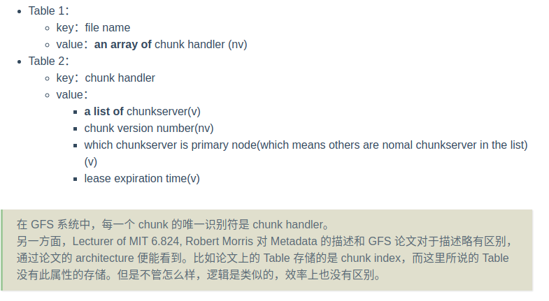

# Google GFS
---
[连接1-GFS论文详解](https://spongecaptain.cool/post/paper/googlefilesystem/)

## GFS是什么？

    Google的文件系统，是一种分布式文件系统，由Google公司开发，运行在Linux上，未开源，所以由雅虎牵头的根据Google三篇论文做出来的Hadoop并没有
    达到官方的速度，在大数据领域只有Google在领跑

    GFS 的地位相当高，早些年基于 GFS 系统的 MapReduce 以及 BigTable 框架实际上随着时代都逐渐被取代了，并且 MapReduce 以及 BigTable
    作为 Google 大数据三驾马车的后两篇论文，也没有 GFS 那样写得详细。

    下图是基于GFS文件系统发展出来的文件系统分支：

---
## GFS介绍

1、GFS系统使用背景：
    
    1.1、分布式组件经常发生错误，应当将此视为常态而不是意外
    2.1、文件通常是大文件、而不是小文件
    3.1、大部分文件通过append新数据的方式实现修改，而不是直接重写现有数据
    4.1、协同设计应用以及文件系统可以提高系统整体灵活性最终使系统受益

2、论文的前提和假设：
    
    2.1、分布式系统的各个组件是廉价的商业主机，而不是专业服务器，不得不频繁的自我检测，发现故障、自我容错、恢复
    2.2、文件数量处于几百万的规模。每个文件通常是100MB（GB），同时也支持小文件
    2.3、读工作模式主要由两种读方式构：大规模的串行读和小部分的随机读
            大规模的串行读：顺序读取数百及以上个KB大小的数据
            小规模的随机读：以任意偏移量读取几个KB大小的数据
    2.4、写工作负载主要是大规模的、连续的写操作，这些操作讲数据追加到文件末尾，写操作的规模通常和大规模串行读的规模类似
    2.5、系统需要支持并发写，即支持数百台并发地追加数据到一个文件，操作的原子性和同步开销是主要的指标
    2.6、高持续带宽比低延迟更重要

3、接口-为完全实现的POSIX

    GFS作为一个分布式文件系统，对外提供了一个传统的单机文件系统接口，但是由于效率和实用性的角度，并没有实现标准的文件系统POSIX API

    文件通过目录进行分层管理，通过路径名来定位，支持文件的 create，delete，open，close，read 以及 write 操作。

    此外 GFS 还支持如下两个特性：
    
        Snapshot 快照：快照指的是以低成本方式创建文件和目录树（directory tree）的副本；
        Record Append 记录追加：记录追加指的是 GFS 允许多个客户机并发安全地向同一文件追加数据，同时保证每个客户追加操作的原子性；

---
## GFS系统架构与设计

1、GFS集群的系统架构

    一个GFS Cluster分为两个组件：
        单个master节点
        多个chunkserver节点

    一个GFS集群同时可以被多个client节点访问
    一个GFS集群的架构可以使用下图表示：

    
    这是个典型的Naster+Worker结构：存在一个Master 来管理任务、分配任务，而 Worker 是真正干活的节点。在这里干的活自然是数据的存储和读取。

2、大文件的分块存储：

    ？：大文件分块存储和 MySQL 的水平扩展、垂直扩展的理念是一样的，或者说类似于 Redis 的主从节点的设计。不过，如果要讨论最基本的原理，
    那便是：将串行通为并行。

    Chunk Size 是整个分布式文件系统的最重要的参数之一，GFS 以 64 MB 为固定的 Chunk Size 大小，这远远大于典型的单机文件系统 chunk 的大小。
    Linux 系统每页4k大小，Chunl内部是按照64kb进行存储的。

    
    分布式系统由于不可避免的故障，因此我们需要使用 replication 机制，每一个 chunk 都存在着若干个副本（它们不一定完全一样 ，因为 GFS 并不是一
    个强一致性文件管理系统），我们称这些 chunk 的副本为 replica（复数形式为 replicas）。每个 chunk 或者 replica 都作为普通的 Linux 文件
    存储在 chunkserver 上。
    
3、大的Chunk有什么优点：

    3.1、减少了 Client 与 Master 服务器交互的次数
    3.2、减少了 GFS Client 与 GFS chunkserver 进行交互的数据开销，这是因为数据的读取具有连续读取的倾向，即读到 offset 的字节数据后，下一
         次读取有较大的概率读紧挨着 offset 数据的后续数据，chunk 的大尺寸相当于提供了一层缓存，减少了网络 I/O 的开销；
    3.3、减少了存储在主服务器上的元数据的大小。这允许我们将元数据保存在内存中。

    缺点：小数据量（比如仅仅占据一个 chunk 的文件，文件至少占据一个 chunk）的文件很多时，当很多 GFS Client 同时将 record 存储到该文件时就会
        造成局部的 hot spots 热点。

    事实上，GFS 并没有很好地支持彻底的小文件系统，应用场景还是大文件存储。

    从上面图示可以看出，每一个文件都被划分为多个 chunk，这里先单独将文件存储拎出来，并不考虑 replication 机制，
    那么一个文件是以如下的形式拆分管理的：
    这里此文件是一个相当大的文件（GB），如果文件足够小，那么仅仅会对应一个 chunk

    File分块存储的特点：
        1、每个chunk的大小固定，默认值是64MB
        2、chunk_1~chunk_n在逻辑上是连续的，但是在磁盘上存储上并不一定是连续的
        3、如果chunk涉及replication，GFS在默认情况下会为每一个chunk多创建2gereplicas，一式三份，分布在多个磁盘上

    但是replication机制带来了额外的复杂性，eg：查找的复杂性。
        解决方式：每一个chunk在创建的时候使用一个不可变的全局唯一64位的ID 身份符来标记，由Master节点在chunk被创建时进行分配

4、单Master节点的设计：

    GFS Master节点负责的工作室系统级别的控制：
        1、chunk的版本控制
        2、孤块的回收
        3、两个chunkservers上的偏移
        4、append record 原子性的确保
        5、metadata的维护和管理

    Master 周期性通过 HeartBeat 机制和每一个 chunkserver 进行通信，进行指令的发送以及状态信息的接收。

    但是需要注意是，GFS 中 Master 节点基于 Master-Worker 模式设计（有点类似于中间件的名称服务器），并没有把 Master 节点作为代理节点，
    换句话说，GFS 中 Master 只是个大老板，或者大管家，但是其本身不干活。这意味着 GFS Client 读写操作的数据 I/O 传输直接与 chunkserver 进行。

    同时，GFS 实际上仅仅拥有一个 Master 服务器，这极大地简化了设计难度，做出快速的决策。
    
5、GFS Client文件数据的步骤：

    1、GFS Client 首先对要读取的字节相对偏移量在 chunk size 固定的背景下计算出 chunk index；一个chunk size为64B
    2、给 GFS Master 发送 file name 以及 chunk index，即文件名和 chunk index(索引)；
    3、GFS Master 接收到查询请求后，将 filename 以及 chunk index 映射为 chunk handle 以及 chunk locations，并返回给 GFS Client；
    4、GFS Client 接收到响应后以 key 为 file name + chunk index，value 为 chunk handle + chunk locations 的键值对形式缓存此次查询信息 ；
    5、GFS Client 向其中一个 replicas (最有可能是最近的副本)发送请求，去请求中指定 chunk handle 以及块中的字节范围；

        如果你足够细心的话，你会注意到从 GFS Master 返回的是 chunk locations，表示 replicas，即多个 replica 的地址。
        注意，如果缓存没有过期，那么 GFS Client 与同一个 replica 对同一 chunk 的读并不需要 clinet-master 进行通信；
        同时，客户端通常会对多个 chunk 进行合理的聚合，可以一次向 master 查询多个 chunk + index 的 metadata，以及一次向 chunkserver 
        读取多个 chunk 的数据；

    注：此处的句柄就是chunk的全局身份标识符

6、Master节点在内存中的设计：

    Table1：基于Hashmap实现，根据filename进行快速的查找，O（1）
    Table2：基于B+树实现，因为可能涉及到大字节的数据，需要一次性返回多个chunk数据，同时也可能存在范围查找

    GFS 系统中，为了加快响应客户端关于 metadata 数据的请求，因此会将 metadata 存储于内存中，但是因为内存是易失性存储体，因此还需要持久化操作。具体来说：
        客户端向 Master 节点请求的 metadata 数据直接存储于 Master 的内存中，避免每次请求都需要进行磁盘 I/O；
        Master 节点使用日志 + checkpoint 的方式来确保数据的持久化；
    

    Q：为什么有 Table1 与 Table2 的持久化机制了，还需要日志和 checkpoint？

    这是因为 Table1 与 Table2 的数据结构无论是 HashMap 还是 B+Tree，如果选择新加入节点后马上进行持久化，那么就会面临随机 I/O 的问题，因为
    它们本质上都基于节点实现，而节点并不基于连续地址进行存储。出于效率的考虑，这两张表并不会在每一个写操作执行时就执行持久化机制，而是定期执行。
    不过定期执行就存在因为掉电、故障后数据丢失问题，因此需要引入日志系统。这通常被称为持久化 snapshot of memory。

    由于日志仅仅就是追加数据，日志的追加操作属于顺序磁盘 I/O，因此每一条写操作生效前都可以提前把日志记录到磁盘上，再进行真正的写操作，因此数据总是
    能够安全地确保持久化。主机重启时重新执行一遍日志即可。

    日志系统非常冗长，如果每次启动 Master 节点时都执行全部的日志记录一次，那么效率就会很低。另一方面，GFS 本身就必然会持久化 Table1、Table2，
    我们应当利用这个特点。checkpoint 就是来解决这个问题的。每次持久化 Table1、Table2 成功后，都会在日志系统上打上一个 checkpoint，用于说明
    下一次启动 master 之后可以先读取持久化了的 Table1、Table2 磁盘数据，然后从日志系统的 checkpoint 向后执行。这样一来 Master 启动时的效率
    就不会很低了，因为并不会将日志从头到尾执行一遍，而仅仅是 checkpoint 到尾执行一遍。另一面，checkpoint 也赋予了日志系统删除陈旧的日志的能力，
    用来节约磁盘空间（checkpoint 前的字节数据理论上都可以删除）。

