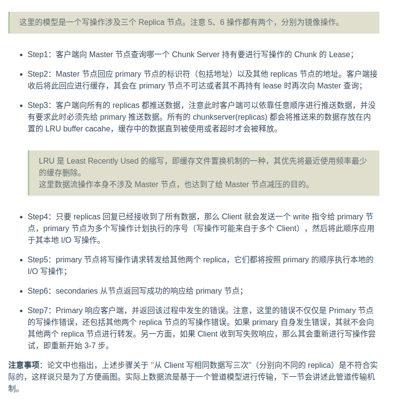

# Google GFS
---
[连接1-GFS论文详解](https://spongecaptain.cool/post/paper/googlefilesystem/)

## GFS是什么？

    Google的文件系统，是一种分布式文件系统，由Google公司开发，运行在Linux上，未开源，所以由雅虎牵头的根据Google三篇论文做出来的Hadoop并没有
    达到官方的速度，在大数据领域只有Google在领跑

    GFS 的地位相当高，早些年基于 GFS 系统的 MapReduce 以及 BigTable 框架实际上随着时代都逐渐被取代了，并且 MapReduce 以及 BigTable
    作为 Google 大数据三驾马车的后两篇论文，也没有 GFS 那样写得详细。

    下图是基于GFS文件系统发展出来的文件系统分支：

---
## GFS介绍

1、GFS系统使用背景：
    
    1.1、分布式组件经常发生错误，应当将此视为常态而不是意外
    2.1、文件通常是大文件、而不是小文件
    3.1、大部分文件通过append新数据的方式实现修改，而不是直接重写现有数据
    4.1、协同设计应用以及文件系统可以提高系统整体灵活性最终使系统受益

2、论文的前提和假设：
    
    2.1、分布式系统的各个组件是廉价的商业主机，而不是专业服务器，不得不频繁的自我检测，发现故障、自我容错、恢复
    2.2、文件数量处于几百万的规模。每个文件通常是100MB（GB），同时也支持小文件
    2.3、读工作模式主要由两种读方式构：大规模的串行读和小部分的随机读
            大规模的串行读：顺序读取数百及以上个KB大小的数据
            小规模的随机读：以任意偏移量读取几个KB大小的数据
    2.4、写工作负载主要是大规模的、连续的写操作，这些操作讲数据追加到文件末尾，写操作的规模通常和大规模串行读的规模类似
    2.5、系统需要支持并发写，即支持数百台并发地追加数据到一个文件，操作的原子性和同步开销是主要的指标
    2.6、高持续带宽比低延迟更重要

3、接口-为完全实现的POSIX

    GFS作为一个分布式文件系统，对外提供了一个传统的单机文件系统接口，但是由于效率和实用性的角度，并没有实现标准的文件系统POSIX API

    文件通过目录进行分层管理，通过路径名来定位，支持文件的 create，delete，open，close，read 以及 write 操作。

    此外 GFS 还支持如下两个特性：
    
        Snapshot 快照：快照指的是以低成本方式创建文件和目录树（directory tree）的副本；
        Record Append 记录追加：记录追加指的是 GFS 允许多个客户机并发安全地向同一文件追加数据，同时保证每个客户追加操作的原子性；

---
## GFS系统架构与设计

1、GFS集群的系统架构

    一个GFS Cluster分为两个组件：
        单个master节点
        多个chunkserver节点

    一个GFS集群同时可以被多个client节点访问
    一个GFS集群的架构可以使用下图表示：

    
    这是个典型的Naster+Worker结构：存在一个Master 来管理任务、分配任务，而 Worker 是真正干活的节点。在这里干的活自然是数据的存储和读取。

2、大文件的分块存储：

    ？：大文件分块存储和 MySQL 的水平扩展、垂直扩展的理念是一样的，或者说类似于 Redis 的主从节点的设计。不过，如果要讨论最基本的原理，
    那便是：将串行通为并行。

    Chunk Size 是整个分布式文件系统的最重要的参数之一，GFS 以 64 MB 为固定的 Chunk Size 大小，这远远大于典型的单机文件系统 chunk 的大小。
    Linux 系统每页4k大小，Chunl内部是按照64kb进行存储的。

    
    分布式系统由于不可避免的故障，因此我们需要使用 replication 机制，每一个 chunk 都存在着若干个副本（它们不一定完全一样 ，因为 GFS 并不是一
    个强一致性文件管理系统），我们称这些 chunk 的副本为 replica（复数形式为 replicas）。每个 chunk 或者 replica 都作为普通的 Linux 文件
    存储在 chunkserver 上。
    
3、大的Chunk有什么优点：

    3.1、减少了 Client 与 Master 服务器交互的次数
    3.2、减少了 GFS Client 与 GFS chunkserver 进行交互的数据开销，这是因为数据的读取具有连续读取的倾向，即读到 offset 的字节数据后，下一
         次读取有较大的概率读紧挨着 offset 数据的后续数据，chunk 的大尺寸相当于提供了一层缓存，减少了网络 I/O 的开销；
    3.3、减少了存储在主服务器上的元数据的大小。这允许我们将元数据保存在内存中。

    缺点：小数据量（比如仅仅占据一个 chunk 的文件，文件至少占据一个 chunk）的文件很多时，当很多 GFS Client 同时将 record 存储到该文件时就会
        造成局部的 hot spots 热点。

    事实上，GFS 并没有很好地支持彻底的小文件系统，应用场景还是大文件存储。

    从上面图示可以看出，每一个文件都被划分为多个 chunk，这里先单独将文件存储拎出来，并不考虑 replication 机制，
    那么一个文件是以如下的形式拆分管理的：
    这里此文件是一个相当大的文件（GB），如果文件足够小，那么仅仅会对应一个 chunk

    File分块存储的特点：
        1、每个chunk的大小固定，默认值是64MB
        2、chunk_1~chunk_n在逻辑上是连续的，但是在磁盘上存储上并不一定是连续的
        3、如果chunk涉及replication，GFS在默认情况下会为每一个chunk多创建2gereplicas，一式三份，分布在多个磁盘上

    但是replication机制带来了额外的复杂性，eg：查找的复杂性。
        解决方式：每一个chunk在创建的时候使用一个不可变的全局唯一64位的ID 身份符来标记，由Master节点在chunk被创建时进行分配

4、单Master节点的设计：

    GFS Master节点负责的工作室系统级别的控制：
        1、chunk的版本控制
        2、孤块的回收
        3、两个chunkservers上的偏移
        4、append record 原子性的确保
        5、metadata的维护和管理

    Master 周期性通过 HeartBeat 机制和每一个 chunkserver 进行通信，进行指令的发送以及状态信息的接收。

    但是需要注意是，GFS 中 Master 节点基于 Master-Worker 模式设计（有点类似于中间件的名称服务器），并没有把 Master 节点作为代理节点，
    换句话说，GFS 中 Master 只是个大老板，或者大管家，但是其本身不干活。这意味着 GFS Client 读写操作的数据 I/O 传输直接与 chunkserver 进行。

    同时，GFS 实际上仅仅拥有一个 Master 服务器，这极大地简化了设计难度，做出快速的决策。
    
5、GFS Client文件数据的步骤：

    1、GFS Client 首先对要读取的字节相对偏移量在 chunk size 固定的背景下计算出 chunk index；一个chunk size为64B
    2、给 GFS Master 发送 file name 以及 chunk index，即文件名和 chunk index(索引)；
    3、GFS Master 接收到查询请求后，将 filename 以及 chunk index 映射为 chunk handle 以及 chunk locations，并返回给 GFS Client；
    4、GFS Client 接收到响应后以 key 为 file name + chunk index，value 为 chunk handle + chunk locations 的键值对形式缓存此次查询信息 ；
    5、GFS Client 向其中一个 replicas (最有可能是最近的副本)发送请求，去请求中指定 chunk handle 以及块中的字节范围；

        如果你足够细心的话，你会注意到从 GFS Master 返回的是 chunk locations，表示 replicas，即多个 replica 的地址。
        注意，如果缓存没有过期，那么 GFS Client 与同一个 replica 对同一 chunk 的读并不需要 clinet-master 进行通信；
        同时，客户端通常会对多个 chunk 进行合理的聚合，可以一次向 master 查询多个 chunk + index 的 metadata，以及一次向 chunkserver 
        读取多个 chunk 的数据；

    注：此处的句柄就是chunk的全局身份标识符

6、Master节点在内存中的设计：

    Table1：基于Hashmap实现，根据filename进行快速的查找，O（1）
    Table2：基于B+树实现，因为可能涉及到大字节的数据，需要一次性返回多个chunk数据，同时也可能存在范围查找

    GFS 系统中，为了加快响应客户端关于 metadata 数据的请求，因此会将 metadata 存储于内存中，但是因为内存是易失性存储体，因此还需要持久化操作。具体来说：
        客户端向 Master 节点请求的 metadata 数据直接存储于 Master 的内存中，避免每次请求都需要进行磁盘 I/O；
        Master 节点使用日志 + checkpoint 的方式来确保数据的持久化；
    

    Q：为什么有 Table1 与 Table2 的持久化机制了，还需要日志和 checkpoint？

    这是因为 Table1 与 Table2 的数据结构无论是 HashMap 还是 B+Tree，如果选择新加入节点后马上进行持久化，那么就会面临随机 I/O 的问题，因为
    它们本质上都基于节点实现，而节点并不基于连续地址进行存储。出于效率的考虑，这两张表并不会在每一个写操作执行时就执行持久化机制，而是定期执行。
    不过定期执行就存在因为掉电、故障后数据丢失问题，因此需要引入日志系统。这通常被称为持久化 snapshot of memory。

    由于日志仅仅就是追加数据，日志的追加操作属于顺序磁盘 I/O，因此每一条写操作生效前都可以提前把日志记录到磁盘上，再进行真正的写操作，因此数据总是
    能够安全地确保持久化。主机重启时重新执行一遍日志即可。

    日志系统非常冗长，如果每次启动 Master 节点时都执行全部的日志记录一次，那么效率就会很低。另一方面，GFS 本身就必然会持久化 Table1、Table2，
    我们应当利用这个特点。checkpoint 就是来解决这个问题的。每次持久化 Table1、Table2 成功后，都会在日志系统上打上一个 checkpoint，用于说明
    下一次启动 master 之后可以先读取持久化了的 Table1、Table2 磁盘数据，然后从日志系统的 checkpoint 向后执行。这样一来 Master 启动时的效率
    就不会很低了，因为并不会将日志从头到尾执行一遍，而仅仅是 checkpoint 到尾执行一遍。另一面，checkpoint 也赋予了日志系统删除陈旧的日志的能力，
    用来节约磁盘空间（checkpoint 前的字节数据理论上都可以删除）。

7、Metadata-元数据

    Master存储三类最重要的metadata数据：1、File、chunk、namespace；2、file到chunk的映射Map；3、每一个chunk replica的存储位置。
    所有的元数据都保存在主服务器的内存中。

    前两种类型(名称空间和文件到块的映射)数据同时也会通过 logging metuations 存储到主机本地磁盘上、复制到远程机器上来持久化。使用日志允许
    我们简单、可靠地更新 Master 的状态，并且不会在主崩溃时出现不一致的风险。另一方面，Master 并不会持久化 chunk replica 的位置信息。其
    通过启动时以及 chunkserver 加入集群时发起 chunkserver 的每个 chunk 数据块位置的询问。

    内存内的数据结构

    元数据保存在 Master 的内存中使得 Master 要对元数据做出变更变得极为容易；同时，这也使得 Master 能够更加高效地周期扫描集群的元数据，这
    扫描主要用户实现垃圾收集、出现 chunkserver 时重新创建其一个副本以及 chunkserver 之间的负载平衡。
    
    唯一的不足在于这使得整个集群所能拥有的 Chunk 数量受限于 Master 的内存大小，不过这是一个小问题，因为对于一个 64MB 大小的 Chunk，Master
    只需要维持不到 64 字节的元数据（虽然前者数据存储在磁盘上，后者数据存储在内存中）。
    
    如果需要支持更大的文件系统，通过给 Master 节点内存扩容代价是不大的，但是这个不大的代价可以带来在内存中存储元数据所获得的简单性、可靠性、性
    能和灵活性。
    
8、Chunk Locations：
    
    Master 服务器不持久化 chunkservers 拥有哪个 chunk 副本的持久记录，而是通过询问实现：
    Master 在启动时通过轮询获取每一个 chunkserver 上所有 chunk replica 的初始值；
    Master 在启动后通过心跳机制来检测每一个 chunkserver 上所有 chunk replica 的变化，以保证其拥有最新的数据。

9、Operation Log

    Operation Log 包含关键metadata 数据更改的历史记录，它是数据库的核心，它不仅是元数据的唯一持久记录，还充当定义并发操作顺序的逻辑时间线、
    文件和块，以及它们的版本都是唯一的，永远由它们创建的逻辑时间来标识。

    由于 Operation Log 日志非常重要，所以我们必须可靠地存储它，并且在元数据的更改被持久化之前，不能使更改对客户端可见。否则，即使块本身存活
    下来，我们也会丢失整个文件系统或最近的客户端操作。因此，我们将它复制到多个远程机器上，只有在本地和远程将相应的日志记录刷新到磁盘之后才响应
    客户机操作。在刷新之前，Master 批处理多个日志记录，从而减少刷新和复制对总体系统吞吐量的影响。

    Master 通过重播操作日志恢复其文件系统状态。为了最小化启动时间，我们必须保持日志较小。每当日志增长超过一定的大小时，Master 检查其状态，
    以便通过从本地磁盘加载最新的 checkpoint 并在此之后仅重放有限数量的日志记录来恢复。checkpoint 是一种紧凑的类似 b 树的形式，可以直接
    映射到内存中并用于名称空间查找，而无需进行额外的解析。这进一步加快了恢复并提高了可用性。
    
    `Master 恢复仅仅需要最新的完整检查点和后续日志文件`。旧的检查点和日志文件可以自由删除，但通常还是会保留了一些近期的日志，以防止意外。

10、Consistency Model-一致性模型

    Guarantees by GFS：

    文件名 namespace 命名空间的变化（比如，文件的创建）全权由 Master 节点在内存中进行管理，这个过程通过 namespace lock 确保操作的原
    子性以及并发正确性，Mater 节点的 operation log 定义了这些操作在系统中的全局顺序；
    
    在数据修改后，文件区域的状态取决于很多个条件，比如修改类型、修改的成功与否、是否存在并发修改，下表总结了文件区域的状态（来自于论文）：

    `GFS对file region状态的概念定义：`

    consistent：所有的GFS Client将总是看到完全相同的数据。
    
    defined：当一个文件数据修改之后，如果file region还是保持 consistent状态，并且所有的client能够看到全部修改的内容。
    
    consistent but undefined：从定义上看，就是所有的Client能够看到相同的数据，但是并不能及时反映并发修改的任意修改。
            这里通常是指写操作冲突了，GFS并不能保证多个客户端的并发写请求的执行顺序，但是保证最终数据的一致性，也就是说它的执行次序并不
            能充分保证，但是最终所有的客户端查询时能读到相同的结果

    inconsistent：因为处于inconsistent状态，因此一定也处于undefined状态，造成此状态的操作也被认为是failed的，不同的Client在读到的
    数据不一致，同一个client在不同的时刻读取的文件数据也不一致
   

    表格将数据的修改分为两种情况：
        1、write：修改File中原有数据，具体来说就是在指定文件的偏移地址下写入数据
            GFS 没有为这类覆写操作提供完好的一致性保证：如果多个的 Client 并发地写入同一块文件区域，操作完成后这块区域的数据可能由各次
            写入的数据碎片所组成，此时的状态最好也就是 consistant but undefined 状态
        2、Record Append：即在原有File末尾Append（追加）数据，这种操作被GFS系统确保为原子操作，这是GFS系统最重要的优化之一。GFS 中
           的 append 操作并不简单地在原文件的末尾对应的 offset 处开始写入数据（这是通常意义下的append操作），而是通过选择一个offset，
           这一点在下面会详细说到。最后该被选择的 offset 会返回给 Client，代表此次 record 的起始数据偏移量。由于 GFS 对于 Record 
           Append 采用的是 at least once 的消息通信模型，在绝对确保此次写操作成功的情况下，可能造成在重复写数据。
        
    在一系列成功的修改操作以后，被修改的文件区域的状态是 defined 并包含最后一次修改的写内容。GFS 通过以下两种方式实现这一目标：
    在所有写操作相关的 replicas 上以同一顺序采用给 chunk 进行修改；
    使用 chunk version numbers（也就是版本号）去检测 replicas 上的数据是否已经 stale（过时），这种情况可能是由于 
    chunkserver 出现暂时的宕机(down)；
        一旦一个 replicas 被判定为过时，那么 GFS 就不会基于此 replicas 进行任何修改操作，客户机再向 Master 节点请求元数据时，
        也会自动滤除过时的 replicas。并且 Master 通常会及时地对过时的 replicas 进行 garbage collected（垃圾回收）。
    
    Q：
        缓存未过期时 replica 出现过时的问题：因为在客户机存在缓存 cache 的缘故，在缓存被刷新之前，客户机还是有机会从stale replica上
        读取文件数据。这个时间穿窗口取决于缓存的超时时间设置以及下一次打开同一文件的限制。另一方面，GFS 中的大多数文件都是 append-only，
        因此 stale replica 上的读仅仅是返回一个 premature end of chunk，也就是说仅仅没有包含最新的追加内容的 chunk，而不是被覆写
        了的数据（因为无法覆写），这样造成的影响也不会很大。

        组件故障问题：Master 节点进行通过与所有 chunkserver 进行 regular handshake（定期握手）来检测出现故障的 chunkserver，
        通过 checksumming（校验和）来检测数据是否损坏。一旦出现问题，GFS 会尽快地从有效的 replicas 上进行数据恢复，除非在 Master
        节点检测到故障之前，存储相同内容的 3 块 replica 都出现故障时才会导致不可逆的数据丢失。不过即使是这样，GFS 系统也不会不可用，
        而是会及实地给客户端回应数据出错的响应，而不是返回出错的数据。

11、Implications for Applications

    1、尽量选择append追加，而不是overwrite覆写，这是因为GFS仅仅保证append操作的一致性，但是覆写操作没有一致性保证
    2、写入数据时使用额外的校验信息，比如校验和（或者其他hash技术）
    3、为了避免write at least once而造成的重复数据，可以通过加入额外的唯一标识符来达到效果

---
##  系统内部的交互

    尽可能减少Master节点的负载

1、Leases and Mutation Order-租赁和修改顺序

    修改操作包括追加和覆写，这两种写操作都会最终作用于所有的 replica（通常意义上说就是一个写指令对应于 3 个 chunk+replica 的 I/O 写）。
    对于 chunk 的写操作涉及两种修改：

    在相关 chunkserver 上进行 I/O 写操作；
    在 Master 节点上修改 metadata；

    Leases的含义是租赁，其用于Master确保多个节点之间写操作顺序的一致性，具体操作如下：
    1、Client 向Master请求本次写操作涉及到的chunk name，通过chunk header 拿到chunk location返回给Client；
    2、Client找到其中一个距离最近的chunk作为primary节点，其他的同种数据的replicas则是secondaries（从属节点），Master 在此消息中还会
        告知被选中的 primary 节点来自客户端的多个写操作请求；
    3、chunkserver收到lease以及写操作请求后，其才认为自己有权限进行写操作，并决定多个写操作的执行顺序，顺序被称为 serial order（串行执行顺序）
        更改本地数据后，同步传递给secondaries节点；
    4、当 primary 决定好顺序后，会将带有执行顺序的 lease 返回给 master 节点，master 节点随后会负责将顺序分发给其他两个 replica。其他两个
        replicas 并没有选择权，只能按照 primary 决定的顺序进行执行。

    这种 Lease 机制减少了 Master 的管理开销，同时也确保了线程安全性，因为执行顺序不再由 Master 去决定，而是由拥有具体 lease 租赁的
    chunkserver 节点决定。租赁的默认占用超时时间为 60s，但是如果 Master 又接收到对同一个 chunk 的写操作，那么可以延长当前 primary
    节点的剩余租赁时间。

    流程如下：

