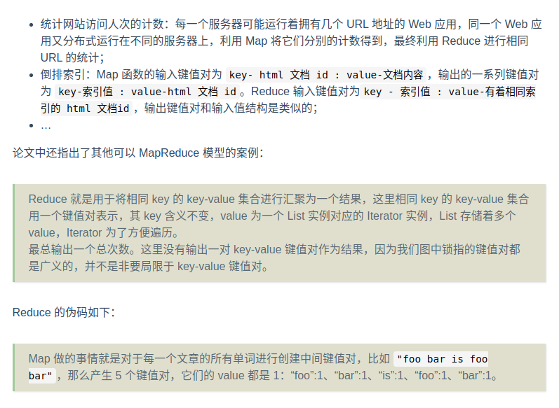

# Google-MapReduce

---
[连接1-MapReduce介绍](https://spongecaptain.cool/post/paper/mapreduce/)

`移动计算比移动数据更划算`

1、MapReduce是什么？用来做什么？

    MapReduce 的本质是一种编程模型，是一种编程方法，抽象理论，其主要用于大规模数据集的并行运算。它极大地方便了编程人员在不会分布式并行编程的情况
    下，将自己的程序运行在分布式系统上。

    MapReduce 在以下背景下产生：单机系统无法处理海量数据，在各大互联网公司已经广泛采用分布式系统，但是缺少同一的范式来简化问题，导致只有少数的技
    术大牛才能写出、搭建出良好的分布式系统。
    
    MapReduce 主要由两个概念组成：

    Map：Map 就是将大数据拆解（映射）为数据集的过程，比如说有辆红色的小汽车，有一群工人，把它拆成零件了，这就是 Map。

    
    Reduce：Reduce 就是组合（聚集），我们有很多汽车零件，还有很多其他各种装置零件，把它们一起拼装，变成变形金刚，这就是 Reduce。

    MapReduce 的核心思想是：对于 PB 级别的数据，它们一定是分布式地存储于不同主机的磁盘上。传统单机的 “输入 –> 计算 –> 输出” 模型已经不能满足
    分布式计算的需求，因为传统单机的输入是本地磁盘，而分布式的输入可以是其他磁盘，因此涉及不稳定且带宽受限的网络。如果我们将数据通过网络 I/O 收集
    到部分主机上进行计算，那么计算的性能主要受限于网络带宽，而不是 CPU、内存。MapReduce 深刻地洞察了这个缺陷，其巧妙地避免了数据在计算时的大批量
    网络 I/O：既然数据是庞大的，而程序要比数据小得多，将数据输入给程序是不划算的，那么就反其道而行之，将程序分发到数据所在的地方进行计算，也就是所
    谓的移动计算比移动数据更划算。

    另一方面 Map 和 Reduce 概念首次提出并不是在 Google 的这篇论文上，而是在 Lisp 语言中提出。Lisp 是一门古老而有先进的语言，起源于 1958年，
    显得古老。但是其推崇函数式编程，到现在看起来，理念还是非常先进。Map 和 Reduce 实际上也是推荐使用函数式编程的方式进行处理，因为通常我们会面临
    不同结构、内容的初始数据集，但是具体处理的方法逻辑是相同的，函数式风格（functional style）就能很好地将相同的方法逻辑抽象出来。因此 Map、
    Reduce 只需要专注于单个处理元素，比如一份 html 文档、一个日志文件，而非 TB 级别的数据。

2、MapReduce用户编程模式

    首先作为一个MapReduce整体，其输入和输出如下图所示：


    
    输入输出都是一系列键值对，或者说是元素类型为键值对的集合，这通常被称为Job。

    Map的函数式编程模型如下：


    输入：一对键值对
    输出：键值对集合
    Map方法执行都被称为Task

    Reduce的函数式编程模型如下：


    输入：键值对集合 a set of key-value，且他们的 key 要求是相同的；
    输出：一对键值对 key-value，如果干脆就什么都输出。
    Reduce 方法执行也被称为 Task。

3、工作流程

    Map和Reduce的关系是由MapReduce分布式系统来协调和确定的：

    1、首先，分布式系统中的不同机器使用Map函数来处理由MapReduce系统分发来的不通的key-value键值对，然后分别产生不尽相同的
        键值对集合，被称为:a set of intermediate key-value pairs;
    2、其次，MR系统负责同意接管多个Map运算得到的多个键值对集合，然后对这些集合进行聚合处理，产生拥有者相同key的KV键值对集合交给
        Reduce来处理；
    3、最后，Reduce负责接收一个有着相同Key的KV键值对集合，然后进行处理，最终生产一个KV键值对，或者干脆就不生产；

    
`事实上为了取出 key 的冗余存储，相同 key 的键值对会优化为单个 key 以及一个 List 或者 Iterator 迭代器。`

    
    case：
    我们有数以百万计的html，我们要求对这些文档中所有出现过的单词做一个统计，要求：
        系统输入为：数以百万计的html文档；
        系统输出为：a set of key-value，key 为单词字符串，value 为单词在上述文档中出现的次数；

    Map的伪代码：
```
// key: docomenmt name 文档名
// value: document contents 文档的内容
map(String key, String value):
        for each word w in value:
        EmitIntermediate(w,"1");
// key: a word 一个单词
// value: a list of counts 单词出现次数对应的 list 的迭代器
        reduce(String key,Iterator values):
        int result = 0;
        for each v in values:
        result += ParseInt(v);
        Emit(AsString(results));
```

    Backup Tasks:
    一种通用的解决方案是在整个 MapReduce 计算快要结束时，master 对当前处于 in-progress 状态的 task 进行备份，无论是原来的 task 执行完毕
    还是备份的 task 执行完毕，那么就认为该 task 完成了。

    导致整个 MapReduce 计算过程被延迟的原因之一是过多的时间花费在最后几个 map task 或 reduce task 上。导致这个问题的原因由很多，可能是因为
    task 所在的节点硬盘的读写速度非常慢，同时 master 又有可能把新的 task 分配给了该节点，所以引入了更加激烈的 CPU 竞争、内存竞争。

    Task Granularity:
    通常情况下，R 的大小是由用户指定的，而对 M 的选择要保证每个 task 的输入数据大小，即一个输入分片在 16MB～64MB 之间，这样可以最大化的利用数
    据本地性。
    在具体的实现中，M 和 R 的大小是有实际限制的，因为 master 至少要做 O(M＋R) 次的调度决策，并且需要保持 O(M\*R) 个状态。
    从上文我们可以得知，map 阶段被划分成 M 个 task，reduce 阶段被划分成 R 个 task，M 和 R 一般会比集群中节点的个数大得多。每个节点运行多个
    task 有利于动态的负载均衡，加速 worker 从失败中恢复。

    Locality:
    输入数据由 GFS 来管理，GFS 把数据存储在集群节点的本地磁盘上，GFS 将文件分割为 64MB 大小的块，并且针对每个块会做冗余（一般冗余 2 份）。
    master 利用输入数据的位置信息，将 map task 分配给输入数据所在的节点。
    如果在计算过程中出现了失败的情况，那么 master 会把任务调度给离输入数据较近的节点。
    网络带宽在计算环境中属于一种非常稀缺的资源，利用输入数据的特性可以减小网络带宽。
    
    Master Failure:
    可以通过定期建立检查点的方式来保存 master 的状态。但是，Google 当时的做法是考虑到只有一个 master，所以 master 出现故障的概率很小，如果
    出现故障了，重新开始整个 MapReduce 计算。

    Worker Failure:
    如果一个 map task 一开始运行在 worker A 上，接着由于 worker A failed 导致该 map task 迁移到 worker B 上。那么读取该 map task 输
    出数据并且处于正在执行的 reduce worker 会收到重新执行 reduce task 的通知，任何还未开始读取数据的 reduce task 也会收到通知。reduce 
    worker 接下来会从 worker B 上读取数据。
    对于已完成的 map task，也需要重新被执行。因为 map task 的输出是在 worker 的本地磁盘上，因为 worker 已经失联了，所以 map task 的输出
    数据自然也获取不到。对于已完成的 reduce task，不再需要重新执行。因为 reduce task 的输出是在全局的文件系统（GFS）上。
    master 会定期 ping worker，如果 worker 没有响应并且超过了一定的次数，那么 master 就认为 worker 已经 failed 了。因此，所有在该 
    worker 上完成的 task 的状态将会被重置为初始的 idle 状态，并且这些 task 需要被重新分配到其它的 worker 上去。类似的，该 worker 上处于 
    in-progress 状态的 task 也会被重置为最初的 idle 状态，并被重新分配到其它 worker 上去。

    流程如下：

    
    正是因为集群中主机数量多，因此一天总会有两三台主机出现故障，因此分布式系统的管理策略很重要。这里还是把 MapReduce 的系统架构图放在这。

    MapReduce 分布式系统的管理应当取决于具体的集群设备性能，Google 实现的 MapReduce 其内部有着成百上千的个人主机（2004 年，现在一定不止这个
    规模），每一个主机仅仅有着 2-4 GB 的内存，网络带宽也仅仅是商用网络，分布式存储则是由 GFS 文件系统来管理。

4、MapReduce分布式系统的管理：

    Build inverted index：倒排索引


    
    倒排索引的案例如下，逻辑是类似的：
    这里多了一个 Shuffle 的过程，Shuffle 本意是洗牌，在这个阶段把相同的 key 的 key-value 放到一个磁盘里，用于 Reduce 阶段的读取。

    统计单次出现数：


    下面还是拿第二节中为所有文档中的单词计数，不过这里将问题简化为只有 3 篇文档，只不过它们都要分别交给不同的 Worker 进行处理：
    
    在执行完成后，实际上产生了 Reduce 节点个数的输出文件，每个reduce worker对应一个。这些文件暂时不需要合并，因为它们往往是下一个MapReduce
    处理逻辑(下一个也就是Reduce操作)的输入数据。而在下一个 MapReduce 上会进行 Shuffle 操作，即从分布在不同磁盘上的有着相同 key的key-value
    pairs聚集到一个磁盘上，这通常是通过网络来完成的，因此这也是 MapReduce 代价最高的一部分。

    Q：MapReduce 没有将所有 key 相同的 key-value 汇集到一起交给 Reduce 节点进行处理，不会有问题吗？
    1、Input 和 Split 过程：MapReduce 库函数将输入数据切分为 M 个分片（分片的大小一般为 16～64 MB，用户可以设置分片大小），并把用户程序拷贝到
        集群中的多个节点（为了分区容错）；
    2、节点说明：图中有分为两种节点：Master 节点用于给空闲的 Worker 节点分配具体的任务，具体的任务可以是 Map 也就是 Reduce。Worker 即可以做
        Map 也可以做 Reduce，其可以执行交替 Map 和 Reduce 方法；
    3、被分配 Map 任务的 Worker 的工作为：
        3.1、首先加载分片 split 数据；
        3.2、然后将 spilit 数据解析为 a set of key-value pairs；
        3.3、接着对每一个 key-value 用 map 函数进行处理，处理的结果是 a set of intermediate key-value pairs；
            处理结果优先存放到内存中的缓存，除非容量不足；
        3.4、缓存在内存中的 key/value pairs 会被划分为 R 个分区，并定期写入到本地磁盘中。写入磁盘的位置会被推送给 master 节点，master 节点会将磁盘的位置信息转发给下一阶段执行 reduce 任务的节点（reduce worker）。
    4、被分配 Reduce 任务的 Worker 的工作为：

        4.1、接收 Master 传来的 a set of intermediate key-value pairs 所处的磁盘位置信息；
        4.2、读取相应的磁盘中的数据，当所有的数据读取完毕后，在内存中按照 key 将所有的 key/value pairs 进行一次排序。
        4.3、这是因为 Reduce 会读取到不同的 key 的键值对，排序是为了使相同的 key 的键值对位置相邻。
        4.4、排序后对进行遍历，执行逻辑是：对于相同 key 的 key-value 作为一个整体传入 reduce 方法；
        4.5、最终将 reduce 方法的执行结果 append 追加在输出文件；

    MapReduce 大致上可以分为 6 个过程：Input，Split，Map，Shuffle，Reduce，Finalize。
    
    split：任务的分发，MapReduce 将输入的海量数据进行逻辑切片，一片对应一个 Map 任务。分布式系统的优势之一就是可以并行地处理海量数据，自然需要
            将数据这块大蛋糕交给不同的主机吃下；
    Intermediate files：在这里是将中间键值对暂存在运行 Map 的主机的磁盘上，事实上现在很多基于或改进于 MapReduce 的相关处理机制会改进这一步，
            因为磁盘读写速度效率比较差；注意事项：Google 实际上自己实现了一个软件文件系统：GFS，因此这里的文件系统并不是很简单。


---
## MapReduce内部运行架构

