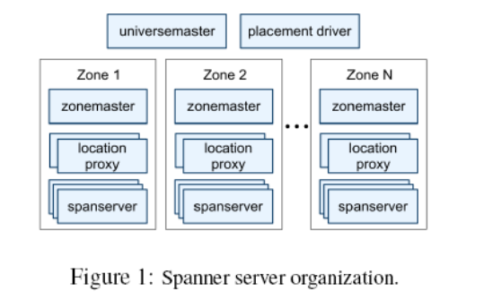
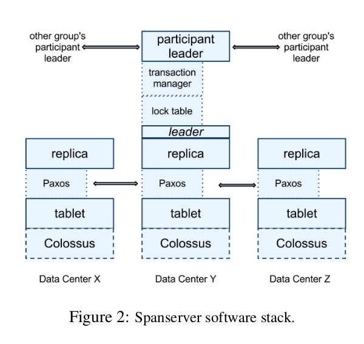
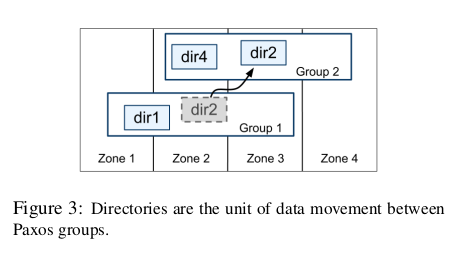
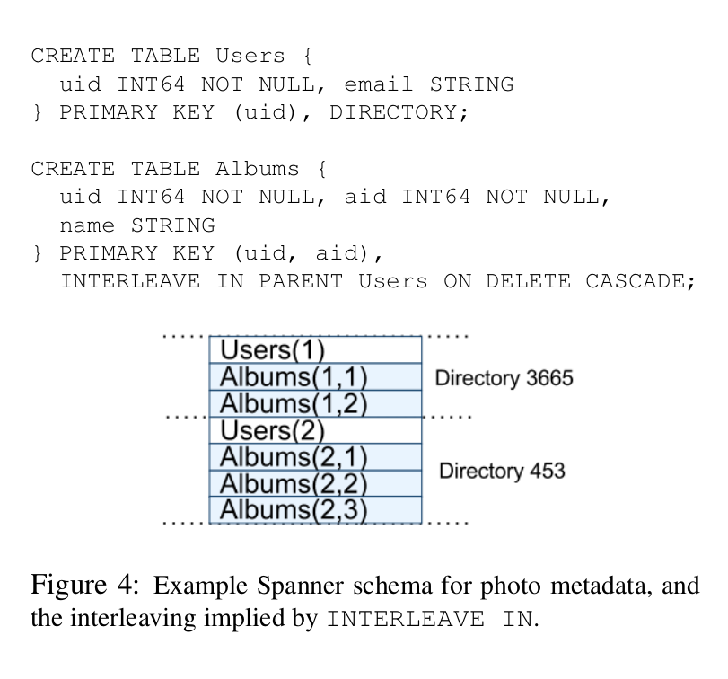
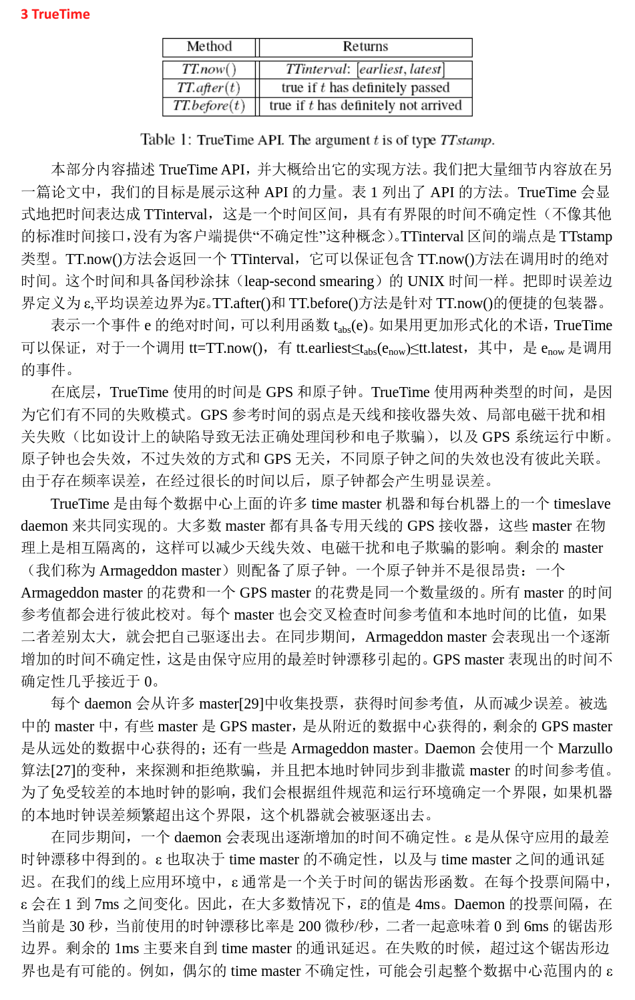
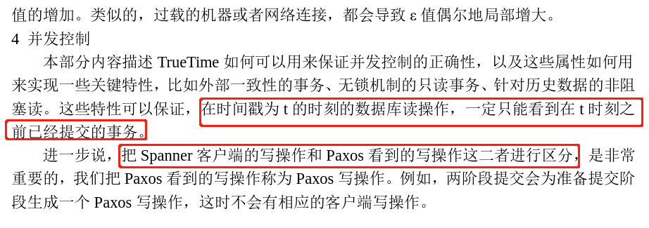
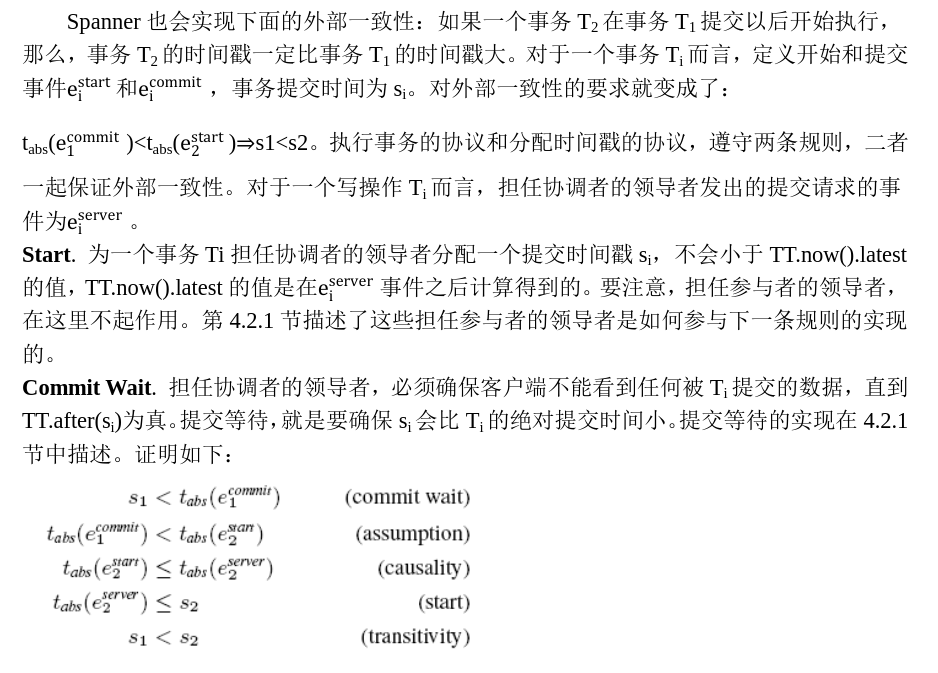

# Spanner 

---

1、是什么？

    Spanner是一个扩展的、全球分布式的数据库

    Spanner已经从一个类似BigTable的单一版本的键值存储，演化为一个具有时间属性的多版本的数据库。
    数据被存储到模式化的、半关系的表中、数据被版本化，每个版本都会自动以提交时间作为时间戳，旧版本的数据会更容易被垃圾回收。
    应用可以读取旧版本的数据。
    Spanner支持通用的事务，提供了基于SQL的基本查询语言

2、特性？
    
    1、在数据的副本配置方面，应用可以在一个很细的粒度上进行动态控制：
        应用可以详细规定，那些数据中心包含那些数据，数据距离用户有多远，不通的数据副本之间距离有多远，以及需要维护多少个副本，数据也可以被动
        和透明地在数据中心之间进行移动，从而平衡不同数据中心内资源的使用。
    2、有两个重要的特性:
        2.1、提供了读写操作的外部一致性
        2.2、在一个时间戳下面的跨越数据库的全球一致性读操作
        这些特性使得Spanner可以支持一致的备份、一致的MapReduce执行和原子模式变更。
    之所以可以支持这些特性，是因为Spanner可以为事务分配全球范围内有意义的提交时间戳，即使事务可能是分布式的。这些时间戳反映了事务序列化的顺序。
    除此以外，这些序列化的顺序满足了外部一致性的要求：如果一个事务T1在另一个事务T2开始之前就已经提交了，那么，T1的时间戳就要比T2的时间戳小。

3、Spanner实现的结构

    一个Spanner部署称为一个universe。假设Spanner在全球范围内管理数据，那么，将会只有可数的、运行中的universe。我们当前正在运行一个测试用的
    universe，一个部署/线上用的universe和一个只用于线上应用的universe。
    
    Spanner被组织成许多个zone的集合，每个zone都大概像一个Bigtable服务器的部署。zone是管理部署的基本单位。zone的集合也是数据可以被复制到的
    的位置的集合。当新的数据中心加入服务，或者是老的数据中心被关闭时，zone可以被加入到一个运行的系统中，或者从中移除。zone也是物理隔离的单元，
    在一个数据中心中，可能有一个或者多个zone，例如，属于不同应用的数据可能必须被分区存储到同一个数据中心的不同服务器集合中。

    图1显示了在一个Spanner的universe中的服务器。一个zone包括一个zonemaster，和一百至几千个spanserver。Zonemaster把数据分配给
    spanserver，spanserver把数据提供给客户端。客户端使用每个zone上面的location  proxy来定位可以为自己提供数据的spanserver。
    Universe  master和placement  driver，当前都只有一个。Universe master主要是一个控制台，它显示了关于zone的各种状态信息，
    可以用于相互之间的调试。Placement driver会周期性地与spanserver进行交互，来发现那些需要被转移的数据，或者是为了满足新的副本约
    束条件，或者是为了进行负载均衡。

4、Span server结构

    解释是如何基于BigTable之上实现复制和分布式事务

    在底部，每个Span server负载管理100-1000个称为tablet的数据结构，一个tablet就类似于BigTable中的Tablet，也是实现了
    对应的映射：
        （key:string,timestamp:int64）->string

    与BigTable不同的是，Spanner会把时间戳分配给数据，这种非常重要的方式，使得Spanner更像一个多版本数据库，而不是一个键值存储。
    一个tablet的状态是存储在类似于B-树的文件集合和写前(write-ahead)的日志中，所有这些都会被保存到一个分布式的文件系统中，这个
    分布式文件系统被称为Colossus，它继承自Google File System。

5、复制：

    1、为了支持复制，每个spanserver会在每个tablet上面实现一个单个的Paxos状态机，（多个比较复杂被舍弃），每个状态机都会在相应的tablet
        中保存自己的元数据和日志。
    2、Paxos实现支持采用基于时间的领导者租约的长寿命的领导者，时间通常在0到10秒之间；
    3、当前的Spanner实现中，会对每个Paxos写操作进行两次记录：一次是写入到tablet日志中，一次是写入到Paxos日志中；
    4、在Paxos实现上采用了管道化的方式，从而可以在存在广域网延迟时改进Spanner的吞吐量，但是，Paxos会把写操作按照顺序的方式执行。

    Paxos状态机是用来实现一系列被一致性复制的映射。写操作必须在领导者上初始化Paxos协议，读操作可以直接从底层的任何副本的tablet中访问状
    态信息，只要这个副本足够新。副本的集合被称为一个Paxos group。

    对于每个领导者的副本而言，每个span server会实现一个锁表来实现并发控制，这个锁表包含了两阶段锁机制的状态：它把键的值域映射到锁状态上面。

    对于每个扮演领导者角色的副本，每个spanserver也会实施一个事务管理器来支持分布式事务。这个事务管理器被用来实现一个participant leader，
    该组内的其他副本则是作为participant  slaves。如果一个事务只包含一个Paxos组（对于许多事务而言都是如此），它就可以绕过事务管理器，因为
    锁表和Paxos二者一起可以保证事务性。如果一个事务包含了多于一个Paxos组，那些组的领导者之间会彼此协调合作完成两阶段提交。其中一个参与者组，
    会被选为协调者，该组的participant leader被称为coordinator leader，该组的participant slaves被称为coordinator slaves。每个
    事务管理器的状态，会被保存到底层的Paxos组。

6、目录和放置

    在一系列键值映射的上层，Spanner实现支持一个被称为“目录”的桶抽象，也就是包含公共前缀的连续键的集合。（选择“目录”作为名称，主要是由于历史
    沿袭的考虑，实际上更好的名称应该是“桶”）。

    一个目录是数据放置的基本单元，属于一个目录的所有数据，都具有相同的副本配置。当数据在不通的Paxos组之间进行移动时，会一个目录一个目录地转移
    如图：

    Spanner可能会移动一个目录从而减轻一个Paxos组的负担，也可能会把那些被频繁地一起访问的目录都放置到同一个组中，或者会把一个目录转移到距离
    访问者更近的地方。

    一个Paxos组可以包含多个目录，这意味着一个Spanner  tablet是不同于一个BigTable tablet的。一个Spanner  tablet没有必要是一个行空间
    内按照词典顺序连续的分区，相反，它可以是行空间内的多个分区。我们做出这个决定，是因为这样做可以让多个被频繁一起访问的目录被整合到一起。

    MoveDir:在不同组之间转移的是分片，而不是整个目录。（当一个目录变得太大时，spanner会自动切片）

    Movedir是一个后台任务，用来在不同的Paxos组之间转移目录。Movedir也用来为Paxos组增加和删除副本，因为Spanner目前还不支持在一个Paxos
    内部进行配置的变更。Movedir并不是作为一个事务来实现，这样可以避免在一个块数据转移过程中阻塞正在进行的读操作和写操作。相反，Movedir会注
    册一个事实(fact)，表明它要转移数据，然后在后台运行转移数据。当它几乎快要转移完指定数量的数据时，就会启动一个事务来自动转移那部分数据，并
    且为两个Paxos组更新元数据。

7、数据模型

    数据模型要比BigTable简单，更易于管理，并且支持在跨数据中心层面进行同步复制。BigTable只可以支持跨数据中心的最终事务一致性（log）。

    应用的数据模型是架构在被目录桶装的键值映射层之上，一个应用会在一个universe创建一个或者多个数据库，每个数据库可以包含无限数量的模式化的表。
    每个表都和关系数据库表类似，具备行、列和版本值。

    Spanner的数据模型不是纯粹的关系型的，它的行必须有名称，更准确的说，每个表都需要包含一个或者多个主键列的排序集合。Spanner看起来仍然有点像
    键值存储：主键形成了一个行的名称，每个表都定义了从主键列到非主键列的映射。当一个行存在时，必须要求已经给行的一些键定义了一些值（即使是NULL）。
    采用这种结构是很有用的，因为这可以让应用通过选择键来控制数据的局部性。

    图4包含了一个Spanner模式的实例，它是以每个用户和每个相册为基础存储图片元数据。这个模式语言和Megastore的类似，同时增加了额外的要求，即每
    个Spanner数据库必须被客户端分割成一个或多个表的层次结构（hierarchy）。客户端应用会使用INTERLEAVE IN语句在数据库模式中声明这个层次结构。
    这个层次结构上面的表，是一个目录表。目录表中的每行都具有键K，和子孙表中的所有以K开始（以字典顺序排序）的行一起，构成了一个目录。ON DELETE 
    CASCADE意味着，如果删除目录中的一个行，也会级联删除所有相关的子孙行。这个图也解释了这个实例数据库的交织层次（interleaved  layout），
    例如Albums(2,1)代表了来自Albums表的、对应于user_id=2和album_id=1的行,目录是453的users表。这种表的交织层次形成目录，是非常重要的，
    因为它允许客户端来描述存在于多个表之间的位置关系，这对于一个分片的分布式数据库的性能而言是很重要的。没有它的话，Spanner就无法知道最重要的
    位置关系。

    
8、TrueTime

9、时间戳管理

    Spanner支持读写事务、只读事务、快照读。

    独立写操作，会被当成读写事务来执行；非快照独立读操作，会被当成只读事务来执行。

    一个只读事务具备快照隔离的性能优势。一个只读事务必须事先被声明不会包含任何写操作，它并不是一个简单的不包含写操作的读写事务。在一个只读事务中的
    读操作，在执行时会采用一个系统选择的时间戳，不包含锁机制，因此，后面到达的写操作不会被阻塞。在一个只读事务中的读操作，可以到任何足够新的副本上
    去执行。

    一个快照读操作，是针对历史数据的读取，执行过程中，不需要锁机制。一个客户端可以为快照读确定一个时间戳，或者提供一个时间范围让Spanner来自动选择
    时间戳。不管是哪种情况，快照读操作都可以在任何具有足够新的副本上执行。

    对于只读事务和快照读而言，一旦已经选定一个时间戳，那么，提交就是不可避免的，除非在那个时间点的数据已经被垃圾回收了。因此，客户端不必在retry
    loop中缓存结果。当一个服务器失效的时候，客户端就可以使用同样的时间戳和当前的读位置，在另外一个服务器上继续执行读操作。

10、Paxos领导者租约

    Spanner的Paxos实现中使用了时间化的租约，来实现长时间的领导者地位（默认是10秒）。
    一个潜在的领导者会发起请求，请求时间化的租约投票，在收到指定数量的投票后，这个领导者就可以确定自己拥有了一个租约。
    一个副本在成功完成一个写操作后，会隐式地延期自己的租约。

    对于一个领导者而言，如果它的租约快要到期了，就要显示地请求租约延期。
    领导者的租约有个时间区间，这个时间区间的起点就是这个领导者获得指定数量的投票那一刻，时间区间的终点就是这个领导者失去指定数量的投票的那一刻
    （因为有些投票已经过期了）。

    Spanner实现允许一个Paxos领导者通过把slave从租约投票中释放出来这种方式，实现领导者的退位。为了保持这种彼此隔离的不连贯性，Spanner会对什
    么时候退位做出限制。把smax定义为一个领导者可以使用的最大的时间戳。在退位之前，一个领导者必须等到TT.after(smax)是真。

11、为读写事务分配时间戳

    事务读和写采用两段锁协议。当所有的锁都已经获得以后，在任何锁被释放之前，就可以给事务分配时间戳。对于一个给定的事务，Spanner会为事务分配时间
    戳，这个时间戳是Paxos分配给Paxos写操作的，它代表了事务提交的时间。
    
    
    Spanner依赖下面这些单调性：在每个Paxos组内，Spanner会以单调增加的顺序给每个Paxos写操作分配时间戳，即使在跨越多个领导者时也是如此。一个单
    个的领导者副本，可以很容易地以单调增加的方式分配时间戳。在多个领导者之间就会强制实现彼此隔离的不连贯：一个领导者必须只能分配属于它自己租约时间
    区间内的时间戳。要注意到，一旦一个时间戳s被分配，smax就会被增加到s，从而保证彼此隔离性（不连贯性）。

12、在某个时间戳下的读操作

13、为只读事务分配时间戳

14、读写事务

    就像Bigtable一样，发生在一个事务中的写操作会在客户端进行缓存，直到提交。由此导致的结果是，在一个事务中的读操作，不会看到这个事务的写操作的
    结果。这种设计在Spanner中可以很好地工作，因为一个读操作可以返回任何数据读的时间戳，未提交的写操作还没有被分配时间戳。

    
15、只读事务

16、模式变更事务

    TrueTime允许Spanner支持原子模式变更。使用一个标准的事务是不可行的，因为参与者的数量（即数据库中组的数量）可能达到几百万个。Bigtable可以
    支持在一个数据中心内进行原子模式变更，但是，这个操作会阻塞所有其他操作。

    一个Spanner模式变更事务通常是一个标准事务的、非阻塞的变种。首先，它会显式地分配一个未来的时间戳，这个时间戳会在准备阶段进行注册。由此，跨越
    几千个服务器的模式变更，可以在不打扰其他并发活动的前提下完成。其次，读操作和写操作，它们都是隐式地依赖于模式，它们都会和任何注册的模式变更时间
    戳t保持同步：当它们的时间戳小于t 时，读写操作就执行到时刻t；当它们的时间戳大于时刻t时，读写操作就必须阻塞，在模式变更事务后面进行等待。如果没
    有TrueTime，那么定义模式变更发生在t时刻，就变得毫无意义。

17、优化