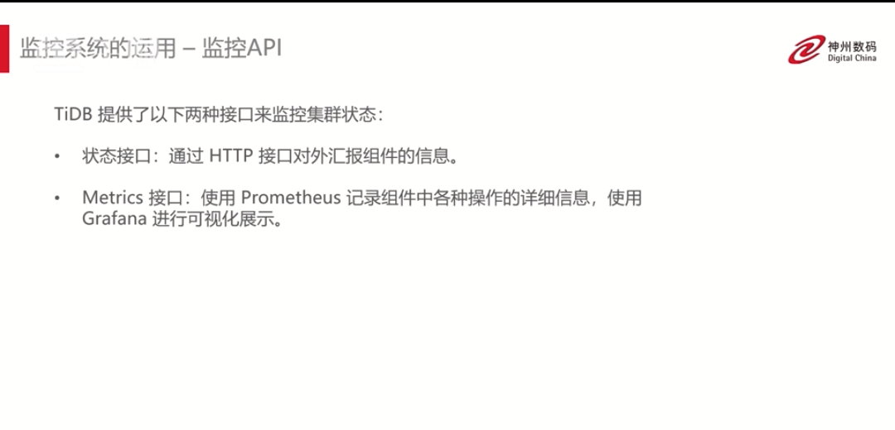

# tidb部署

# tidb执行SQL过程

# tidb监控
---
1、TiDB的监控系统：Grafana/Prometheus

    Prometheus:是一个拥有多维度数据模型的、灵活的查询语句时序数据库、提供本地存储和分布式存储、可以通过基于HTTP的pull模型来采集时间序列数据、
    可以利用push gateway来实现push模式、可以通过动态服务发现或者静态配置来发现目标机器、支持多种数据和图表

    Grafana：是一个开源的metric分析及可视化系统、可以通过将采集到的数据进行一个查询然后进行一个可视化展示并且可以及时的报警通知

2、tidb监控结构：

3、监控系统的部署：
    手工部署比较复杂要下载三个组件的包，采用tiup自动部署比较方便

拓扑图配置：

监控系统的运用-Dashboard(tidb v4后使用的一个可视化界面),可以用于诊断查询TiDB集群（pd的IP地址默认是2379端口号）
    
    3.1 可以查看整体的QPS数值、执行耗时等
    3.2 可以查看组件以及主机的运行状况
    3.3 分析集群读写流量分布以及趋势变化
    3.4 可以列出所有SQL查询耗时等执行信息
    3.5 详细了解耗时较长的sql语句执行信息
    3.6 可以查看日志分析

tidb也可以通过监控API来查看集群的状态

4、实验配置

----

# tidb业务数据同步、迁移和备份

---

1、需求、场景介绍

    系统重构、数据库设计不合理、业务不断增长

2、数据备份

3、数据迁移工具—Dumpling
    
    该工具可以吧存储在TiDB/Mysql中的数据导出为SQL或者CSV格式，可以用于完成逻辑上的全量备份或者导出

4、数据迁移工具-Lighting

    大量新数据的快速导入、全量备份数据的恢复

5、备份流程--BR（backup/restore）
    
    1、根据从PD获取的TiKV信息，向TiKV节点发送备份请求
    2、TiKV收到备份请求后，遍历节点上所有的Region leader，通过生成相应的时间点的版本数据存储生成SST文件
    3、备份完成后，在备份目录下生成SST文件（备份数据信息）和backupmeta文件（元数据信息）

    恢复：
    1、根据聚合表解析SST文件
    2、区域根据SST文件的关键范围进行预细分，因此每个区域至少对应一个SST文件
    3、遍历每个表以恢复该表和相应的SST文件
    4、查找与文件对定的区域，将下载文件的请求发送到相应的TiKV节点，并在成功下载后发送加载请求

---

# tidb系统表和常规表的操作

---

1、连接TiDB

2、SQL的基本操作

    DDL、DML、DQL、DCL

    DDL：drop、create、alter
    DML：insert、update、delete
    DQL：select
    DCL：commit、rollback

3、TiDB系统表介绍

    