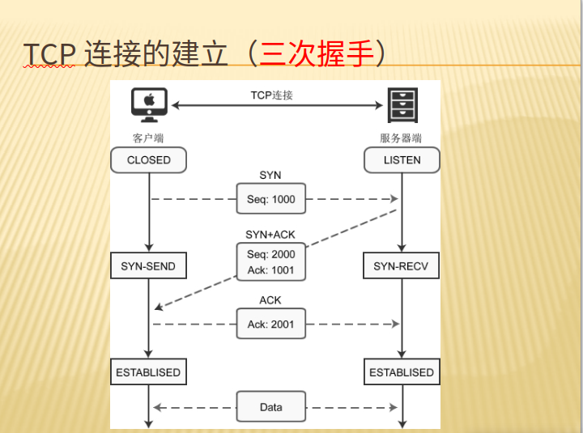

# 三次握手（TCP建立连接状态）
---
1、TCP标志位

    1.1 SYN（synchronous）:发送/同步标志，用来建立连接，与ACK搭配使用
    1.2 ACK（acknowledgement）:确认标志，表示确认收到请求
    1.3 PSH（push）：表示同送操作
    1.4 FIN（finsh）：结束标志，用于结束一个TCP会话
    1.5 RST（reset）：重置复位标志，用于复位对应的TCP连接
    1.6 URG（urgent）：紧急标志，用于保证TCP连接不被中断，并且督促中间层设备尽快处理

    1.7 Sequence number：顺序号，发送数据包中的第一个字节的序列号
    1.8 Ackmowledge number: 确认号，响应前面的seq，值为seq+1

2、TCP三次握手

    三次握手的目的是连接服务器指定的端口，建立TCP连接，并同步连接双方的顺序号和确认号并交换TCP信息

    1、客户端调用connect（）函数，TCP协议会创建一个数据包，并设置SYN标志位，同时生成一个随机数字 seq 1000，填充序号（Seq）字段，
    表示该数据包的序号，开始向服务器端发送数据包，客户端就进入了SYN—SEND状态

    2、服务器端收到数据包，检测到已经设置了SYN标志位，就知道这是客户端发来的建立连接的“请求包”，服务器也会组建一个数据包，并设置SYN和ACK标志位
    随机生成一个数字填充Seq。返回 `ACK=SYN+1`,服务器将数据包发出，进入SYN-RECV状态

    3、客户端收得到数据包，检测到已经设置了SYN标志位，便知道这是服务器端发来的确认包，会检测它的ACK标志位，是否是上次的Seq+1,如果是就说明建立成功了

    4、客户端会继续组件数据包，并设置ACK标志位，将ACK+1发送给服务器端，发出数据包，客户端进入established状态，表示连接已经成功建立

    5、服务器端收到数据包，检测到已经设置了ACK标志位，就知道这是哭护短发来的确认包，检测是否是ACK+1 ，如果是就说明建立成功，服务器进入established状态

    6、传递数据

3、安全问题

    针对TCP连接的安全问题：SYN攻击

    SYN 属于DOS攻击的一种，它利用TCP协议的缺陷，通过发送大量的半连接请求，耗费CPU和内存资源

    原理：在三次握手过程中，服务器发送SYN-ACK（确认收到客户端请求的连接）之后，收到客户端的ACK（第三个包）之前的TCP连接称为半连接(half-open connect).
    此时服务器处于SYN_RECV（等待客户端相应）状态，如果接收到客户端的ACK，则TCP连接成功，如果未接受到，则会重发请求直至成功。
    SYN攻击就是 攻击客户端 在短时间内伪造大量不存在的IP地址，向服务器不断地发送SYN包，服务器回复确认包，并等待客户的确认，由于源地址是不存在的，
    服务器需要不断的重发直 至超时，这些伪造的SYN包将长时间占用未连接队列，影响了正常的SYN，目标系统运行缓慢，严重者引起网络堵塞甚至系统瘫痪。

    检测：检测SYN攻击非常的方便，当在服务器上看到大量的半连接状态时，特别是源IP地址是随机的，基本上可以断定这是一次SYN攻击。

    防范：主要有两大类，一类是通过防火墙、路由器等过滤网关防护，另一类是通过加固TCP/IP协议栈防范.但必须清楚的是，SYN攻击不能完全被阻止，
    我们所做的是尽可能的减轻SYN攻击的危害，除非将TCP协议重新设计。

    过滤网关防护：网关超时设置、SYN网关、SYN代理
    
    加固TCP/IP协议栈：SynAttackProtect机制、SYN cookies技术、增加最大半连接数、缩短超时时间

