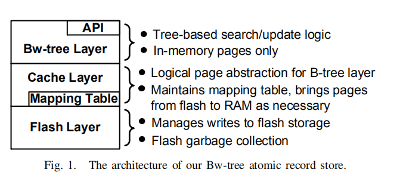

# Bw-Tree（TODO）

---
[链接1](https://www.cnblogs.com/Amaranthus/p/4375331.html#_Toc415387501)

[链接2](https://zhuanlan.zhihu.com/p/29314464)
---
优化：
Bw-Tree主要做了2个优化：

- 通过无锁的方式来操作b+tree，提升随机读和范围读的性能。核心的思想是把b+tree的page通过page id（PID）映射map，map的[key, value]变成[PID, page value]，把直接对page的修改，变成一个修改的操作记录，加入到“page value”，所以“page value”可能是一个“base page”即page原始的内容，和一串对page修改形成的记录的链表，而在修改记录链表中加入一个修改记录节点可以很容易变成一个无锁的方式来实现。另外就是对btree的split和merge操作也通过类似的原理，把具体的操作细化成好几个原子操作，避免传统的加锁方式。
- 把传统checkpoint刷page的变成通过log struct storage方式刷盘，把随机写变成顺序写，提高写的性能。

---
1、原子记录存储

- Atomic Record Stores

- ARS支持每个独立的记录的读写，记录都是以key来识别。基于树的ARS可以提供更快的key range 扫描。ARS不单单是访问方法，也包含了固态存储的管理，并且要求在系统奔溃之后可以恢复。Bw树就是利用ARS形成新的b树。

2、环境：

- 注意一下两点

    - a.多核cpu提高了高并发，并发的增加会导致latch的block，限制了可扩展性。
    - b.好的多核处理器依赖于高cpu cache的hit率。
    
- 对于第一点，bwTree是latch-free，这样thread在碰到冲突的时候，不会被yield或者重定向。对于第二点，bwtree使用增量更新，避免page中的更新，保护之前cache line的地址。

- 针对现代存储的设计：磁盘的延迟是主要的问题，flash存储有很快的随机和顺序读取性能，但是因为在写入之前需要先擦除，所以随机写会比顺序写速度要慢。Bwtree会生产日志结构，这种方法可以避免FTL保证写入性能尽量的高。

3、实现：
- Bwtree通过mapping table来组织，page的大小和位置被虚拟化。实际上是对latch-free和日志结构的虚拟化。
- 通过在原来的page前加上一个增量记录来更新bwtree。
- 对page的splitting和merge做了设计。SMOs由多个原子操作实现，若thread发现有在处理的SMO操作，并不会堵塞而是来完成SMO操作。
- 日志结构存储(LSS)，是名义上的page存储，实际上是通过post增量的修改来提高存储的效率。
- 根据LSS和bwtree来实现ARS。
- 会做这些实现是因为，认为latch free技术和状态修改避免了update-in-place可以再当前处理器上得到性能提升。

4、Bw-Tree的体系结构

- Bw-tree是典型的b+树，提供对数级的访问

- Bw-tree层在最上面，和Cache层交互，cache管理建立在存储层之上，实现了LSS。现在LSS是使用flash存储，但也可以支持磁盘。

- Mapping Table:
  - Mapping Table在Cache层维护，mapping table包含了物理页到逻辑页的映射，每个逻辑页都有一个PID来识别。PID可以通过mapping table翻译成内存的物理地址或者flash的偏移地址。Bwtree就是通过PID来构建一个b+树。
    mapping table隔离了物理地址和bwtree节点，这样每次修改page或者写入到固态存储不需要把位子的修改传播到树的根部，即更新节点内部的连接。这样的重定向可以支持在内存中的增量修改可以支持在固态存储的LSS。
    因为bwtree是逻辑的不是固定的物理地址，就可以根据自己需要制定node的page。
    
- 增量更新：

  - Page的状态改变是通过在原来的page前加一个增量记录来实现的。使用CAS指令把增量记录的物理内存地址放到mapping table的page物理地址栏中。如果成功增量记录地址会变成的page 的新物理地址。这个策略被使用在数据修改，也被使用在树的结构修改。
    间歇的来固化page(创建一个新的page把所有的增量修改合并)，减少链的长度，提高查询的性能。固化的方式也是通过CAS指令实现，之前的page也会被回收。
    在增量更新的同时，可以支持同时在bwtree中做latch-free的访问并且能够防止update-in-place保护cpu cache。Mapping table是bwtree重要的特性，可以隔离直接对node更新。
    
- Bw-Tree结构修改：
  - Latch并不会对做结构修改的page进行保护，如page split。
    为了解决这个问题，就把SMO放在一个顺序的原子化操作中，每个操作都是通过CAS进行。为了保证没有线程等待SMO。如果一个线程看到一个未完成的SMO，会在执行自己的线程前先去完成它。
    
- 日志结构化存储(LSS)：
  - Page批量的顺序写入，大大减少了IO次数。因为回收机制，日志结构通常会有额外的写入来重定位page，用来回收日志的存储空间。
    当刷新page的时候，只需要刷新增量部分，增量的部分表示从上次刷新到当前的增量修改。通过增加flush buffer的page数量来减少IO的消耗。但是这样会有读惩罚，因为page中的数据不是连续被存放的。
    LSS会清理之前的部分flash，这部分flash表示之前的数据。通过清理，LSS把page和它的增量连续的存放，可以提高访问性能。
    
- 管理事务日志：
  - 和传统的数据库系统一样，ARS也要在系统crash时保持数据一致性。通过log sequence number(LSN)来表示每个更新操作。
    和传统系统一样，page的刷新的懒惰的，并且依赖于 write-ahead log协议(WAL)。不同的是在WAL之前不会堵塞page的flush。因为现在的update生成的基于之前page的增量。
    
