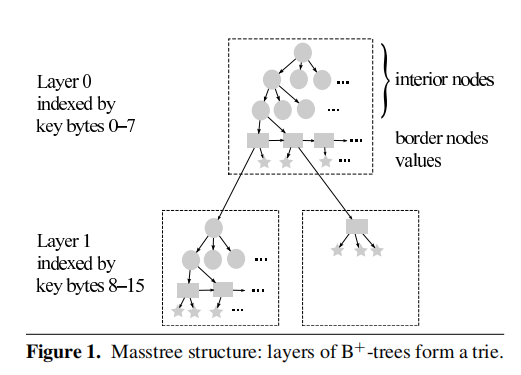
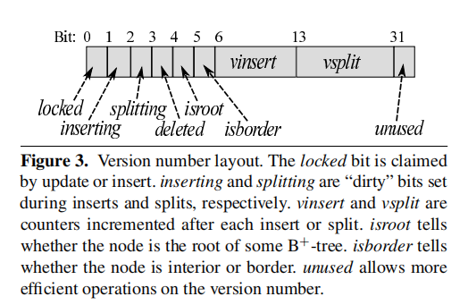
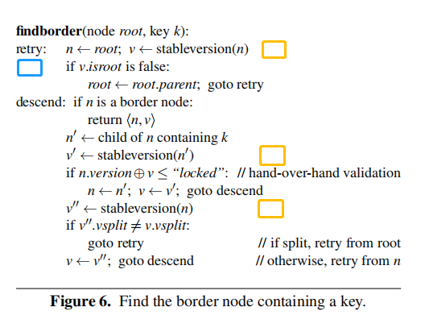
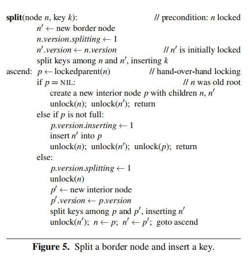
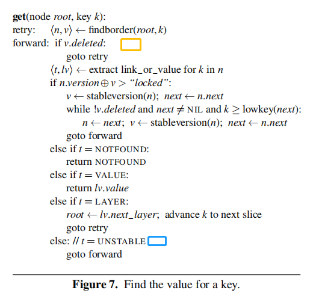
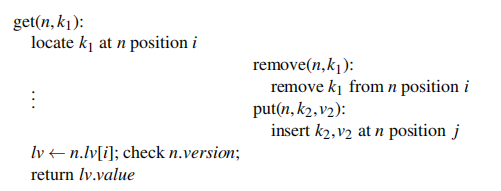

# Mass Tree

---

从结构上来说，Mass Tree 是由一层或多层 B+ 树组成的 Trie 树。

- 圆形代表内部节点（interior node，也就是 B+ 树的 branch node），矩形代表边缘节点（border node，也就是 B+ 树的 leaf node），五角星代表 value。border node 的 value 域可能存放的是数据，也可能存放的是下一层子树的根节点。

- 每个虚线框代表一棵 B+ 树，对于每一层（Layer）的 B+ 树，采用8字节进行索引。长度小于 (8h + 8) 字节的 key 会被存放在 layer <=h。比如，两个 key 存放在 layer 1，那么它们的前8字节是相同的。

- 同一层的所有叶节点会被双向连接（next 和 prev）在一起，但是内部结点是不连接的，这和 Blink Tree 不一样，后者对所有节点维护单向连接（next），所以 Mass Tree 在进行根节点到叶子节点的下降过程时，逻辑和 Blink Tree 是不一样的。

- Blink Tree 的每一个 border node 都带有一个 higher key，用于判断是否需要进行节点右移，但是 Mass Tree 没有 higher key，所以判断是否右移需要获取下一个节点。

---

##  Mass Tree 算法

并发策略：

- fine-grained locking，即节点锁，解决 write-write 竞争，同一时刻只有一个线程可以对当前节点进行写操作

- optimistic concurrency control，即节点 version (uint32_t)，解决 read-write 竞争，读开始前和读结束后都需要获取当前节点的最新 
  version，来判断在读过程中当前节点是否发生了写操作（插入或分裂），同时对节点的写操作都需要先修改 version，在插入 key 之前需要设置 
  inserting 标记，插入完成之后将 insert 的 vinsert + 1；在分裂之前需要设置 splitting 标记，分裂完成之后将 split 的 vsplit + 1
  

- version 也被划分成了多个域，除了带有 insert 和 split 信息之外，还包含一个 lock bit，用于加锁；一个 root bit，用于指示否是根节点；
  一个 border bit，用于指示是否是 border node；一位 deleted 位，用于指示这个节点是否被标记为删除。
  
下降流程：

- 首先，在开始读取节点之前，必须获得节点的 stable version（图中橙色方块），即 version 中的 inserting 和 splitting 位都为0。

- 其次，在下降之前，需要获取最新的 root，因为在开始下降前，根节点可能分裂了，导致其发生了改变（图中蓝色方块）。

- 最后，如果当前节点已经是叶节点，那么可以返回，否则需要进行下降，读取内部结点根据 key[x, x+8)(8字节) 获得下降节点之后。

- 分三种情况处理：

  - case1：读取前后没有发生任何的变化，可以安全的下降；
  - case2：节点发生了变化，而且是分裂，那么我们需要从根节点重新进行下降（内部节点没有相互连接起来，所以不能像 Blink Tree 那样获取右节点）；
  - case3：节点发生了变化，但只是插入，只需要重新对当前节点进行下降
  
- 注意第二个黄色方块，它似乎可以挪到 case 1 的 if 语句里面，但实际上不能这样做。因为如果当前节点的孩子节点发生了分裂，
  但是还没来得及将新节点插入到当前节点，对调这两行代码，可能会导致下降到错误的节点。
  
插入流程：

- 当我们通过 findborder 下降到叶节点后，需要对其加锁（图中蓝色方块），但是此时并不能直接将 key 进行插入，当两个写线程同时下降到同一个叶节点时，只有一个线程可以进行写入，所以加锁后需要查看在加锁前是否有其他线程对这个节点进行了写入，如果有的话需要查看是否需要右移，这里的逻辑和 Blink Tree 是一样的

- 当我们成功加锁并且定位到正确的叶节点之后，可以进行写入，结果有4种：

  - 插入 key 成功或 key 已经存在；
  - 需要下降到下一层，同时需要增加索引的偏移；
  - 存在索引冲突，比如 "12345678AA" 和 "12345678BB"，此时需要创建一棵子树，存放 "AA" 和 "BB"，同时需要把原来存放 "AA" 的地方替换成这棵子树的根节点
  - 节点已满，需要分裂之后再次插入
  
分裂流程：

- 分裂流程和 Blink Tree 是一样的逻辑，需要同时锁住当前节点以及父节点，分为三种情况：

  - 当前节点没有父节点，即当前节点是某个子树的根节点或者整棵树的根节点，在这种情况下我们需要生成新节点作为根节点。有个特殊的地方需要处理，对于子树来说，它的节点存放在上层的叶节点中，但是上图中并没有提到当子树分裂时，如何将上层叶节点中旧的根节点替换掉，这里有两种处理方法：
  - 懒惰处理，不设置根节点的父节点，但是会在写路径中添加判断，当从叶节点下降到某个子树的根节点时，会判断其是否是真正的根节点，如果不是的话，会追溯到新的父节点，然后在叶节点替换掉旧根节点（这种懒惰处理的思想很巧妙）；
  - 设置子树的根节点的父节点为上一层的叶节点，只需要在 case1 和 case2 中添加一种 case，处理子树根节点的替换（这两种方法没有优劣之分）
  
  - 父节点没有满，则只需要将 fence key 和新节点插入到父节点
  - 父节点已满，需要分裂父节点然后进行插入，之后需要将分裂的新节点提升到更上层
  
- Q:Mass Tree 每个节点都有一个指向父节点的指针，Blink Tree 的节点可以不需要父节点，请问这是为什么？

读取流程：

整体而言和插入流程是一样的

- unstable 状态（图中绿色方块），插入流程的 case 3，当出现8字节索引相同时，需要生成子树来替换掉这个 value，但是这个操作不会修改 inserting 或者 splitting 标记，所以需要先标记这个 slot 为 unstable，然后把 value 替换为子树根节点的指针（以及一些其他操作），来防止读到不稳定状态（说实话，这个状态的引入似乎增加了复杂性，其实可以在替换之前标记 inserting，这样也会触发重试）；

  
删除流程：

- 这里只讨论逻辑删除，物理删除需要额外的技术
- 逻辑删除和B+树的类似，但是我们并不对 key 少的节点进行合并，当节点 key 减少到0时，需要标记这个节点为 deleted，然后将其从父节点删除，同时如果是叶节点的话，还需要维护叶节点的双向连接（这是为什么叶节点需要双向连接的一大原因，维护起来简单）。如果某棵子树为空的话也可以删除整棵子树。当其他线程发现节点处于 deleted 状态时，需要进行重试，因为这个节点逻辑上是不存在的。

- 除此以外还有一种特殊情况需要考虑:

- 左边的线程根据 k1 定位到了位置 i，在读取 v1 之前这个节点发生了删除位于位置 i 的 k1，同时在位置 j 处插入 k2，如果 i 等于 j，可能导致左边的线程读取到 v2，为了解决这个问题，需要在索引 i 被删除后重新利用时增加节点的 vinsert 域。

---

## Mass Tree 总结

- Trie 和 B+ 两种索引树的结合，使得在下降过程中的重试不需要从整棵树的根节点开始，同时加快拥有相同前缀的 key 的处理速度
- 具体的内部结点与外部节点的结构
- fine-grained locking 写以及 lock-free 读
- 比较具体的节点删除机制
- 较小的节点减少了线程的竞争

---

## Palm Tree（TODO）
