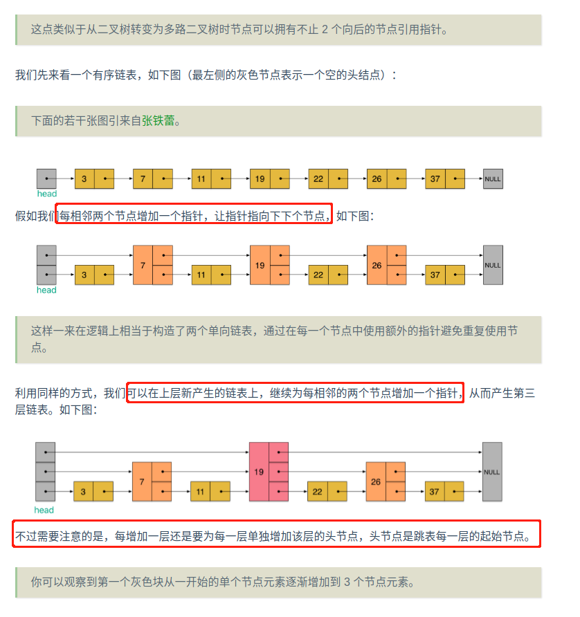

# 跳表-skip-list

---
[连接1-跳表](https://spongecaptain.cool/post/datastracture/skiplist/)

1、逻辑上的跳表

    将跳表称为跳跃链表更合适

    1.1、无论那种数据结构，如果想要提高查询的效率，势必需要引入顺序性，eg：
        有序数组：采用二分法来加快查询速度
        B+树：采用B+树作为数据结构的索引可以依赖于有序快速进行查找

        上述两种方式的查询时间复杂度都是 O(logN) ，但是有着各自的缺点：
        有序数组的缺点：插入新元素时需要以二分法进行比较，时间复杂度 O(logN)，然后插入时需要将待插入位置以及后续元素整体向后搬移，时间复杂度 O(N)。
        可见有序数组在插入元素时开销非常大；
        B+ 树：B + 树可以说是对红黑树的改进版本，主要缺点在于具体实现比较复杂；

    1.2、跳跃表基于有序链表实现，链表的插入元素和查询的效率如下：

        插入时无法使用二分法，因而需要从前向后遍历比较，直到找到应当插入的位置。比较的效率为 O(N)，插入的效率为 O(N)；
            链表解决了数组的单纯插入操作效率较低问题，但是却额外引入了比较无法使用二分法效率低下的问题，其和数组相比效率甚至更差一些。
            本质原因：仅仅为了有序性在付出额外性能开销，但是没有从有序性得到任何性能上的好处。
        查询时也无法使用二分法，因而需要从前向后遍历比较查询，比较的效率为 O(N)；

    1.3、可见链表的最大的问题就是不能使用二分法进行查询，无论是查询还是插入元素都需要依次遍历，节点元素之间的有序性根本就没用到。
        为此，跳跃表吸收了 B+ 树的思想，也使用索引，只不过跳跃表的索引`基于链表`实现而非树实现，其实现如下图所示：

    在这里，我们从原有序链表中取出奇数位置的节点作为关键节点链表，在查询或者插入比较时，先通过关键节点链表的比较再去原有序链表中进行比较。例如，
    如果要插入值为 13 的节点，那么原本需要比较：1、4、9、14 节点，现在只需比较 1、9、14 节点，平均可以节约 1/2 的查询时间。

    不过，这里由于节点较少，查询效率的提高并不明显，另一方面，仅仅只有一层关键节点链表仅仅能提高一倍的查询效率，为了解决这个问题，我们可以建立多
    层关键链表节点，每一层都选取下一层的部分节点作为元素，比如我们建立两层索引的跳表的数据结构如下：

    
    可见，最终的查询效率为原本的 2^n^ 倍，其中 n 为索引的层数，不过效率的提高有一个极限，意味当最高层索引元素只有 2 个时，已经不够再向上叠加新
    的索引层了，换言之，最终的查询效率至多可以到 O(logN)。

    跳跃表的 skip 含义就是为了强调虽然其基于链表，但是不同于链表单向的逐个节点比较，而是可以跳跃若干个节点后进行比较（跳跃即逐个的反义词）。

    1.4、问题：

    跳跃表和大多数索引数据结构有着一样的问题，在元素删减的时候需要维护索引数据结构，具体来说便是：

    添加新元素节点时，如果索引不同时进行更新，那么索引就会因为没有覆盖大部分元素而降低查找效率；
    删除新元素节点时，如果索引中有对应的节点，如果此时不删除，那么就会引发空指针异常；
    删除节点时通过高层索引向低层索引层层递进，查找，因此时间复杂度在层数最高时为O(logN)，逻辑也比较简单，相当于查询的过程中顺便将节点元素删除了。

    添加节点时逻辑要更复杂一些，因为涉及将哪一个节点选举为高层索引的问题。每一层对于新添加节点的选举逻辑是抛硬币，也就是有 50% 的概率选举为上层链
    表的节点，被选举的节点需要插入到上层链表的相应位置中。然后，又进行抛硬币，判断是否要选举到上上层链表。因此一个新接入的节点即可能没有加入任何索
    引中，也有可能加入到所有索引中。这是一个递归的过程，直到某一次选举失败。

    为什么采用抛硬币的方式？

    节点选举是比较困难的，因为跳跃表的节点增删操作不可预测，很难用一种有效的算法确保跳表的索引对于最底层的链表来说是均匀的；
    如果强行追求上层节点个数恰好为下层节点个数的 2 倍，那么
    大数据理论告诉我们，当节点元素足够多时，这种选举策略是趋近于均匀分布的；
    
    1.4、总结：
    增加元素：
        新节点和各层索引节点逐一比较，确定原链表的插入位置。O(logN)
        把索引插入到原链表。O(1)
        利用抛硬币的随机方式，决定新节点是否提升为上一级索引。结果为 “正” 则提升并继续抛硬币，结果为 “负” 则停止。O(logN)
    删除元素：
        自上而下，查找第一次出现节点的索引，并逐层找到每一层对应的节点。O(logN)
        删除每一层查找到的节点，如果该层只剩下 1 个节点，删除整个一层（原链表除外）。O(logN)
        总体上，跳跃表删除操作的时间复杂度是 O(logN)。

2、实际的跳表

    逻辑上的跳表有一个问题，节点信息存在冗余存储：

    存在冗余的节点有：
        节点1、15出现了三次
        节点9出现了2次

    为了避免存储信息的冗余，我们对于原有序链表的每一个节点不再要求其仅仅能使用一个向后的指针，而是多个。

    改进：

3、跳表与其它的数据结构

    跳跃表和平衡二叉搜索树的区别：

    3.1、数据结构不同：跳跃表基于链表，平衡二叉搜索树基于树；
    3.2、索引的维护效率：跳跃表依靠抛硬币的随机方式维护索引（要求尽量平衡或平均），成本比较低，而平衡二叉搜索树需要基于特定的 reblance 算法重新调整
    树状结构。
    3.3、平衡性：跳跃表的平衡性依据随机性来包装，因此最终的查找效率至多趋近于 O(logN)，但是平衡二叉树通过 rebalance 算法，能够达到 O(logN) 的查
    找效率；
    3.4、范围查找的复杂性：在做范围查找的时候，平衡树比 skiplist 操作要复杂。在平衡树上，我们找到指定范围的小值之后，还需要以中序遍历的顺序继续寻找
    其它不超过大值的节点。如果不对平衡树进行一定的改造，这里的中序遍历并不容易实现。而在 skiplist 上进行范围查找就非常简单，只需要在找到小值之
    后，对第 1 层链表进行若干步的遍历就可以实现。
    3.5、内存占用角度：从内存占用上来说，skiplist 比平衡树更灵活一些。一般来说，平衡树每个节点包含 2 个指针（分别指向左右子树），而 skiplist 
    每个节点包含的指针数目平均为 1/(1-p)，具体取决于参数 p 的大小。如果像 Redis 里的实现一样，取 p=1/4，那么平均每个节点包含 1.33 个指针，
    比平衡树更有优势。
    3.6、算法难度：从算法实现难度上来比较，skiplist 比平衡树要简单得多了；

    Hash 表的独有特点：skiplist 和各种平衡树（如 AVL、红黑树等）的元素是有序排列的，而哈希表不是有序的。因此，在哈希表上只能做单个 key 的查找，
    不适宜做范围查找。所谓范围查找，指的是查找那些大小在指定的两个值之间的所有节点。
    
    查询效率的比较：查找单个 key，skiplist 和平衡树的时间复杂度都为 O(logN)，大体相当；而哈希表在保持较低的哈希值冲突概率的前提下，查找时间复
    杂度接近 O (1)，性能更高一些。所以我们平常使用的各种 Map 或 dictionary 结构，大都是基于哈希表实现的。

---
## Java实现代码

[代码](skip_list/src/com/tmp/struct/Test.java)
