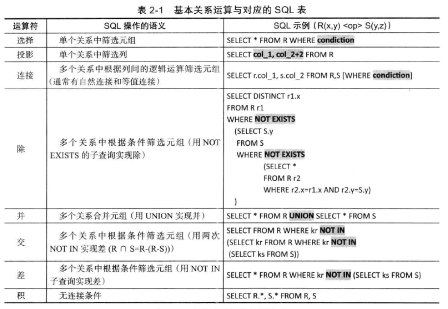
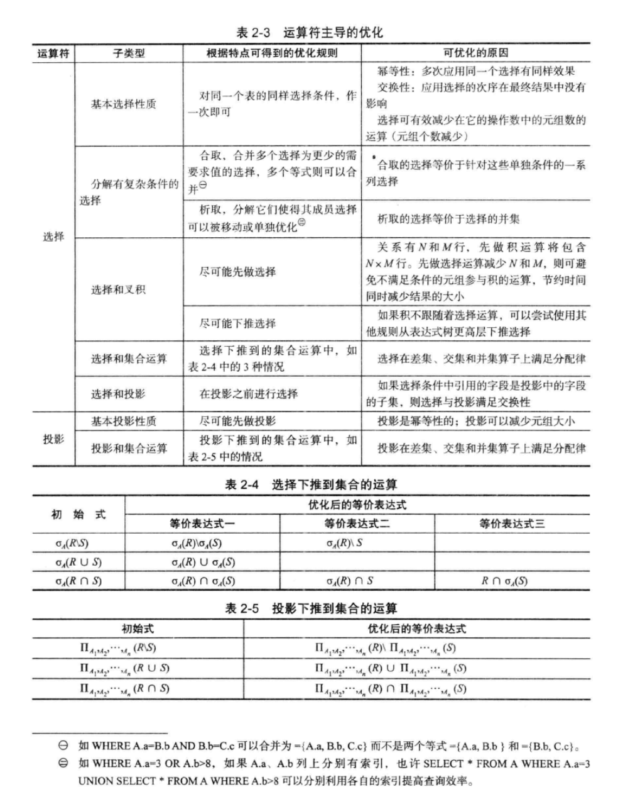
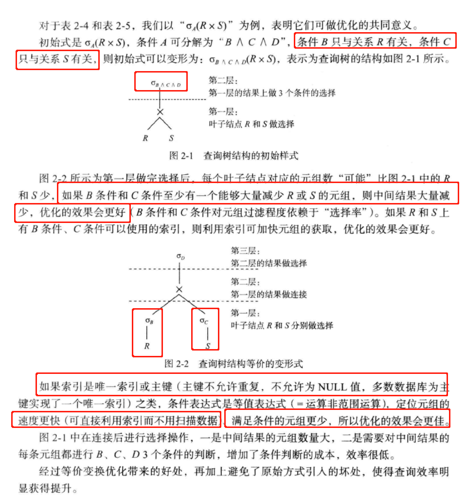
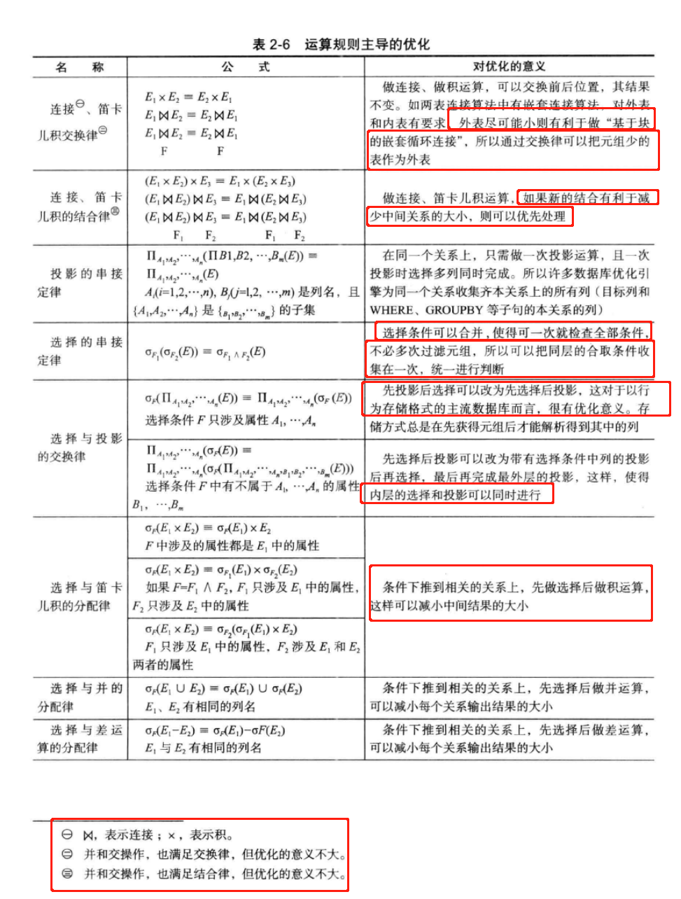
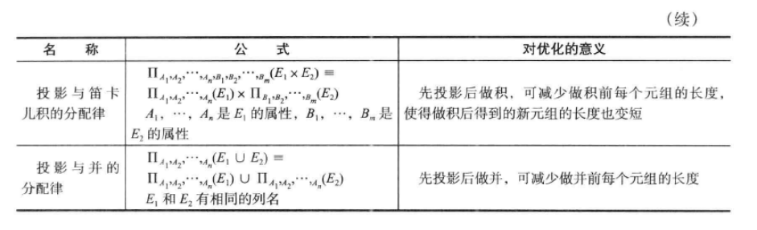
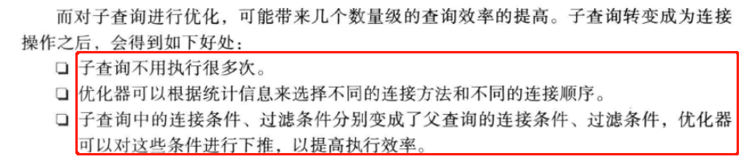
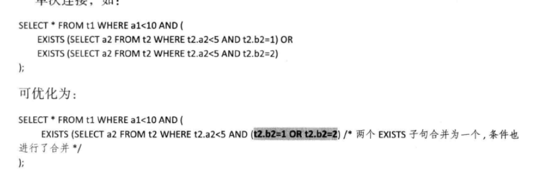
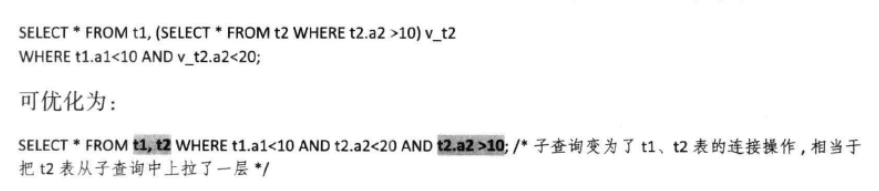
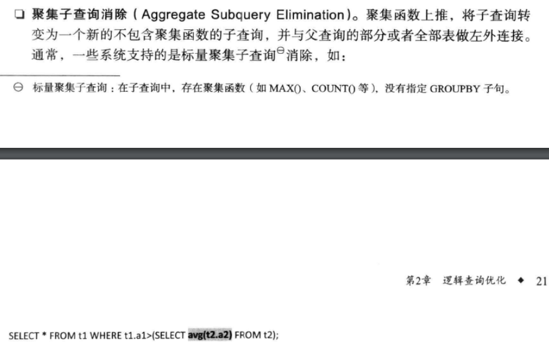
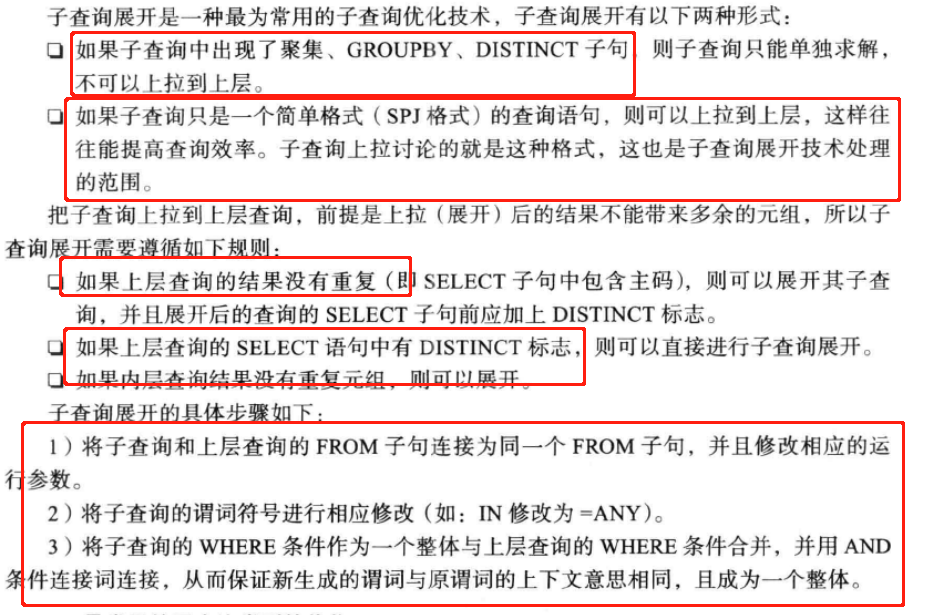

# 逻辑查询优化

- 如何找出sql语句等价的变换形式，是的SQL执行更高效

- 优化思路包括

    - 子句局部优化：等价谓词重写、where、having条件化简
    - 子句间局部关联优化：外连接消除、连接消除、子查询优化、视图重写，它们之间都需要借助其它子局、表定义或列属性等信息进行
    - 局部与整体的优化：如OR重写或操作、UNION操作
    - 形式变化优化：子句嵌套连接
    - 语义优化：sql含义语句完整性约束
    - 其它优化：
  
### 关系代数

- 关系（表）

= 关系的元数据---表的结构，列或属性
- 关系的数据---表的行数据，tuple或record
- 关系进行的操作，就是关系运算

- 种类：

  - 并（UNION）、交（INTERSECTION）、差（DIFFERENCE）、积（EXTENDED CARTESIAN PRODUCT/笛卡尔积）
  - 选择（SELECT）、投影（PROJECT）、连接（JOIN）、除（DIVIDE）
    
  - other
  
- 查询语句可以表示为一棵二叉树：

  - 叶子是关系（表）
  - 内部结点是运算符（算子）
  - 子树是子表达式
  - 根结点是最后的远算符
  - 一棵树就是一个查询路径
  
- 查询优化就是找出代价最小的二叉树
- 查询代价估算就是通过比较和计算找出花费最少的最优二叉树

#### 从运算符进行考虑

- 选择优化举例

#### 从运算规则进行考虑

- 规则

---
### 查询重写规则

- 传统的事务处理（OLTP），使用基于选择投影连接3种基本操作相结合的查询，SPJ查询

- 选择下推：尽量减少连接操作前的元组数，是的中间临时关系尽量少，可以减少IO和CPU

- 投影操作：投影下推，目的是尽量减少连接操作前的列数。！！！选择操作是使元组的个数尽量少、而投影操作是使一条元组尽量小

- 连接操作：对应连接条件
  - 多表连接中每个表被连接的顺序决定着效率（需要计算暗中连接次序效率是最高的）
  - 多表连接每个表被连接的顺序由用户语义决定（不能随意更改）

- 针对SPJ查询，就是结合以上三种优化相结合
- 针对非SPJ查询，在SPJ基础上存在GROUP BY操作的查询，较为复杂

#### 子查询的优化

- 从子查询出现在SQL语句中的位置看，它可以出现在目标列、FROM子局、WHERE子句、JOIN/ON子句、GROUP BY子句、HAVING子句 、
  ORDER BY子句，根据位置不同，优化影响也不同
  - 目标列位置：只能标量子查询，子查询只能返回一个字段的提示
  - FROM子句位置：
    - 相关子查询，可能在FROM子句中出现的子查询无法参考相同查询级别中的关系，所以相关子查询不能出现在FROM子句中
    - 非相关子查询出现在FROM子句中，可以直接上拉子查询到父层，在多表连接时同意考虑连接代价后择优
  - WHERE子句位置：该子查询是一个条件表达式的一部分，表达式可以分解为操作符和操作数，数据类型不通、操作数类型也不同， 要求必须标量子查询
  - JOIN/ON子句位置：该子句可以拆分成两部分，一是JOIN块类似于FROM子句，二是ON子句块类似于WHERE子句，处理方式同上
  - GROUP BY、ORDER BY：无实际的意义
  
- 子查询分类：
  - 相关子查询：依赖于外层父查询的一些属性值
  - 非相关子查询：与外层查询并无关系
  
  - 从谓词看，可以分为
    - [NOT]IN/ANY/SOME子查询
    - [NOT]EXISTS子查询
    - SPJ子查询
    - GROUP BY 子查询
    - 标量子查询：返回的结果集类型是一个单一的值
    - 列子查询：返回类型必须是一条单一元组
    - 表子查询：返回类型是一个表
  
- 子查询的优化思路：
  - 原因：
  
    
  - 子查询优化技术
    - 子查询合并：多个子查询能够合并成一个子查询，将多次表扫描、多次连接减少为单次表扫描和连接
      
    - 子查询展开：把某些子查询重写为等价的多表连接操作
      
    - 聚集子查询消除
      
      
- 子查询展开
  

