# Google BigTable

---
[连接1-google bigtable](https://spongecaptain.cool/post/paper/bigtable/)

[连接2-SSTable具体的函数操作](https://leveldb-handbook.readthedocs.io/zh/latest/sstable.html#)

---
## 是什么？

1、是一种压缩、高性能、高可扩展性的，基于Google文件系统（GFS）的数据存储结构。

2、借鉴了并行数据库和内存数据库的特性。

3、不支持完整的数据模型，只为用户提供简单的数据模型

4、数据没有固定的格式，用户可以自定义数据的schema

5、支持使用行名或者列名作为索引，名字可以是任意字符串

6、四个目标：

    wide applicability
    scalability
    high performance
    high availability

---
## 数据模型

1、BigTable其逻辑上可以提供表的功能，但在物理结构上基于Map实现

    A Bigtable is a sparse, distributed, persistent multidimensional sorted map.

    persistent：一个表是一个包含海量Key-Value键值对的Map，数据是持久化存储的
    distributed：这个大的Map需要支持多个分区来实现分布式
    multidimensional sorted map：这个 Map 按照 Row Key 进行排序，这个 Key 是一个由 {Row Key, Column Key, Timestamp} 组成的多维结构
    Sparse：每一行列的组成并不是严格的结构，而是稀疏的，也就是说，行与行可以由不同的列组成：
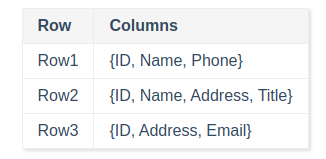
    
    BigTable的每一个键值对key都为Row key + column key + Timestamp的结构，Value则是字符串

2、专有名词

    1、row key：行关键字可以是任意的字符串，最大容量是64kb，按照字典序组织数据
    
    2、tablet：在bigtable中相同的数据可以有很多，为此行区间需要动态划分，每个行区间称为Tablet（子表），是bigtable数据分布和负载均衡的基本单位，
    不同的子表默认的最大尺寸为200MB，Tablet是一个连续的Row Key区间，当table的数据量增长到一定大小可以自动分解为两个tablet，同时也支持合并。

    3、column key与column family：
    Column Key 一般都表示一种数据类型，Column Key 的集合称作 Column Family(列族)。存储在同一 Column Family 下的数据属于同一种类型，
    Column Family 下的数据被压缩在一起保存。
    在 Bigtable 中列关键字的命名语法为：family:qualifier 即 "列族:限定词"，列族名称必须是可打印的字符串，限定词则可以是任意字符串

    4、timestamp：是64位整形，既可以由系统赋值也可由用户指定。

---
## BigTable的框架

    是在Google的其他基础设施之上构建的：
        1、依赖workQueue负责故障处理和监控
        2、依赖GFS存储日志文件和数据文件
        3、依赖Chubby存储元数据和进行主服务器的选择

    Bigtable 主要由链接到每个客户端的库、主服务器和多个子表服务器组成：
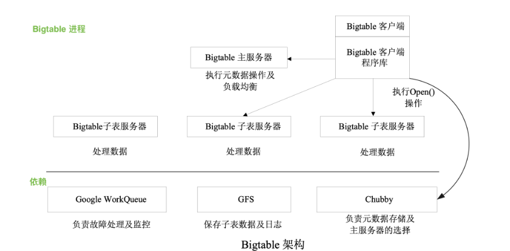

1、Chubby：

    依赖Chubby提供的锁服务，如果Chubby长时间不能访问，Bigtable也无法使用。
        1.1、确保任意时间至多存在一个活跃的主服务器副本
        1.2、存储Bigtable中数据的bootstrap location（引导位置）
        1.3、发现Tablet服务器，并在子表服务器失效时进行善后
        1.4、存储 Bigtable 的 schema 信息，即表的 column family 信息
        1.5、存储Access control lists（访问控制列表）

2、主服务器
    
    主服务器起到系统管家的作用，主要用于为子表服务器分配子表、检测子表服务器的加入或过期、 
    进行子表服务器的负载均衡和对保存在 GFS 上的文件进行垃圾收集。主服务器持有活跃的子表服务器信息、
    子表的分配信息和未分配子表的信息。如果子表未分配，主服务器会将该子表分配给空间足够的子表服务器。

3、子表服务器：
    
    每个子表服务器管理一组子表（a set of tablets），负责其磁盘上的子表的读写请求，并在子表过大时进行子表的分割。
    与许多单一主节点的分布式存储系统一样，读写数据时，客户端直接和子表服务器通信，因此在实际应用中，主服务器的负载较轻。

4、客户端程序库：
    
    客户端使用客户端程序库访问 Bigtable，客户端库会缓存子表的位置信息。当客户端访问 Bigtable 时，首先要调用程序库中的
    Open() 函数获取文件目录，文件目录可能在缓存中，也可能通过与主服务器进行通信得到。最后再与子表服务器通信。

5、元数据信息：
    
    Bigtable使用三层B+树结构来存储元数据信息，第一层是存储在Chubby中的根子表，根子表是元数据表的第一个子表，根子表，
    包含了所有元数据子表的位置信息，元数据子表包含了一组用户子表的位置信息，在元数据的三级结构中，根子表不会被分割，用
    于确保子表的层次结构不超过三组。
    由于元数据大约存储1kb的内存数据，在容量限制为128MB内的元数据子表中，三层模型可以标记2^34个子表。
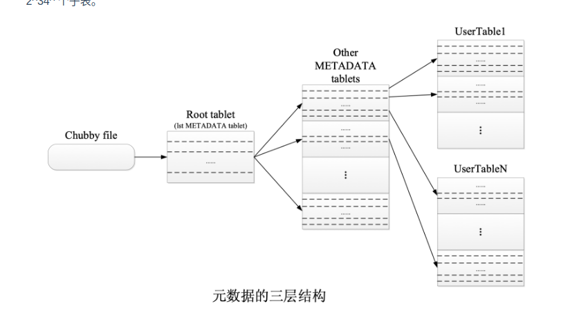

6、元数据的三层结构：

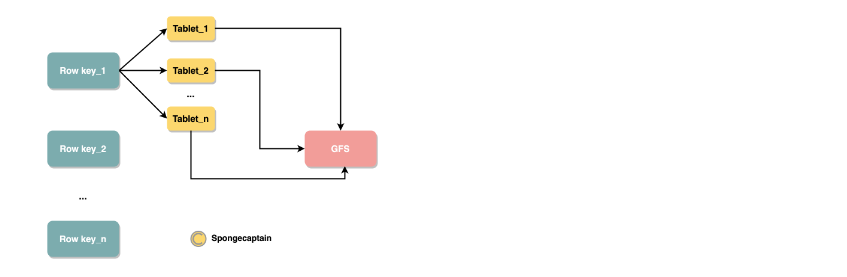
    
    特点：
        6.1、拥有相同row key的键值对分别对应多个Tablet进行分布式存储（每个tablet大小是20MB）
        6.2、ablet 是 Bigtable 中数据分布和负载均衡的最基本单位，这个性质对于 GFS 系统来说，就是 GFS 会为每一个
            Tablet 默认提供 3 个副本，每一个副本尽量存储在不同机架上的不同主机的磁盘上

---
## 客户端的数据读取流程

    更加灵活的Key-Value数据存储模型，对外暴露一个逻辑上的多维表:
    `（row：string，column：string，time：int64）——》string`

    当客户端读取数据时：在内部的流程如下：
        1.1、确定Row key
        1.2、根据Row key查找特定的Column Key
        1.3、根据Column以及version确定具体读取的内容

    客户端定位子表服务器的时候：
        2.1、需要访问Chubby以获取根子表地址，然后浏览元数据表定位用户数据
        2.2、子表服务器会从GFS中获取数据，并将结果返回给客户端
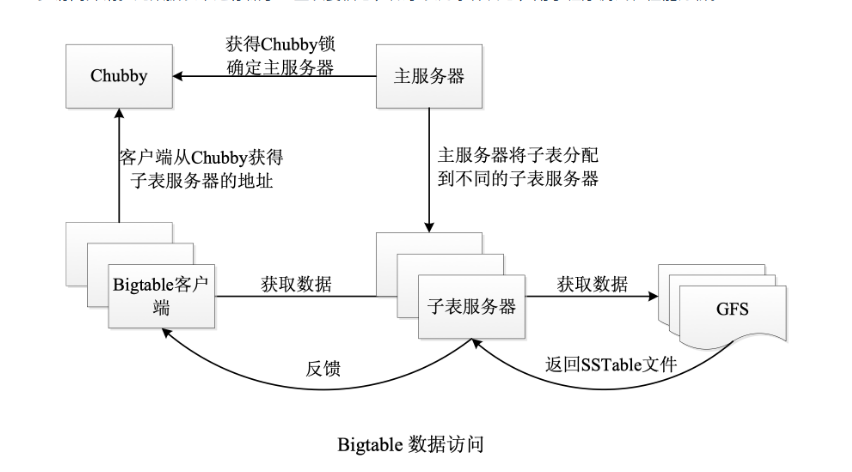

    通常而言，为了加快数据访问以及数据的分块存储管理，存储系统通常会提供各种排序逻辑，在 Bigtable 中的排序逻辑主要有三种：
        3.1、利用 Row Key 进行排序，目的是横向化划分为多个 Tablet，避免形成超大块的数据，便于数据管理；
        3.2、利用 Column key 以及 Column family 进行排序，目的是加快检索时的速度；
        3.3、利用 timestamp 的天然时间线排序，目的是提供多版本控制以及过期数据的自动回收；

---
## 从LevelDB的实现来理解Bigtable的SSTable数据结构---LSM是一种分层的数据结构（其核心便是SSTable数据结构）

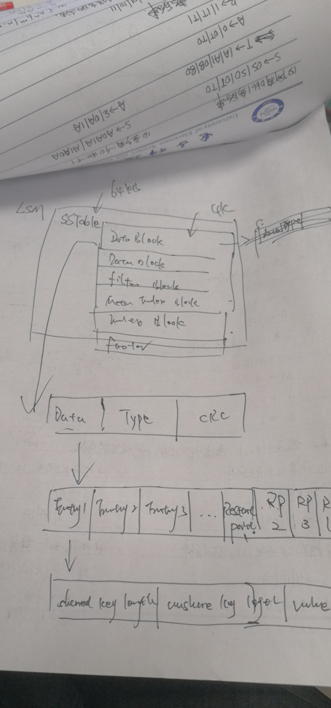

1、含义：

    持久化存储、有序、不可变性、纯文本存储、映射式查找（可以进行key或者key range查找），分块（block/chunk 64kb大小）
    块索引机制：在SSTable内部每一个block都有索引，索引在打开SSTable时被加载到内存中

    
2、LevelDB对SSTable的具体实现：

    论文中并没有给出SSTable的具体结构，不过可以通过levelDB学习
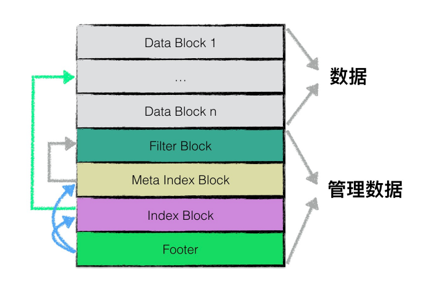
    
    各个分块的主要作用：
    data block ：用来存储kv键值对
    filter block：用来存储一些过滤相关的数据
    meta index block：用来存储filter block的索引信息（主要指偏移量和数据长度）
    index block：用来存储data block的索引信息

3、data block数据结构：
    
    为了提高整体的读写效率，一个 sstable 文件按照固定大小进行块划分，默认每个块的大小为 4KB（这个大小比 Bigtable 论文中所说的
    64KB 要小上不少）。每个 Block 中，除了存储数据以外，还会存储两个额外的辅助字段：

        压缩类型
        CRC 校验码

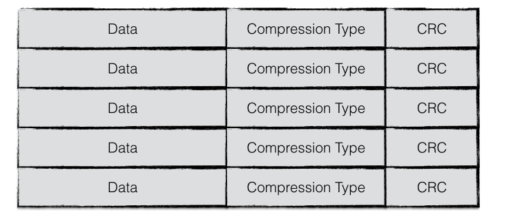

    数据压缩：压缩类型说明了Block中存储的数据是否进行了数据压缩，若是，采用了那种算法进行压缩
    校验码：CRC校验码是循环冗余校验校验码，校验范围包括数据和压缩类型

    单独将Data列拿出来，逻辑按照以下划分：
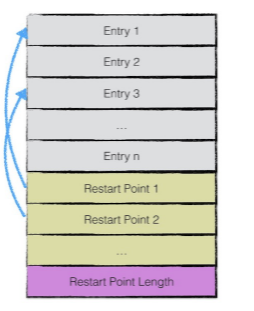

    第一部分的Entry*用来存储key-value数据，由于SSTable中所有的key-value都是严格按序存储的，
    用了节省存储空间，levelDB并不会为每一对key-value对都存储完整的key值，而是存储与上一个key
    非共享的部分，避免了key重复内容的存储。

    每间隔若干个 key-value 对，将为该条记录重新存储一个完整的 key。重复该过程（默认间隔值为 16），
    每个重新存储完整 key 的点称之为 Restart point。Restart point 实际上连续存储，如上图的连续
    黄色块所示。

    leveldb 设计 Restart point 的目的是在读取 SSTable 内容时，加速查找的过程。
    由于每个 Restart point 存储的都是完整的 key 值，因此在 SSTable 中进行数据查找时，可以首先利用
    restart point 点的数据进行键值比较，以便于快速定位目标数据所在的区域；
    当确定目标数据所在区域时，再依次对区间内所有数据项逐项比较 key 值，进行细粒度地查找；
    Spoongecaptain 的看法：在相同 key 规模不大的情况下这种方式查询效率不差，如果规模巨大，使用树状结构应当要好一点。
    该思想有点类似于跳表中利用高层数据迅速定位，底层数据详细查找的理念，降低查找的复杂度。

    每一个Entry的数据结构如下所示：

    
    一共分为5部分：
    1、shared key length：与前一条记录key共享部分长度；
    2、unshared key length:与前一条记录key不共享部分的长度；
    3、value length：value长度；
    4、unsharded key content：与前一条记录key非共享的内容；
    5、value：value的内容
    
    eg:
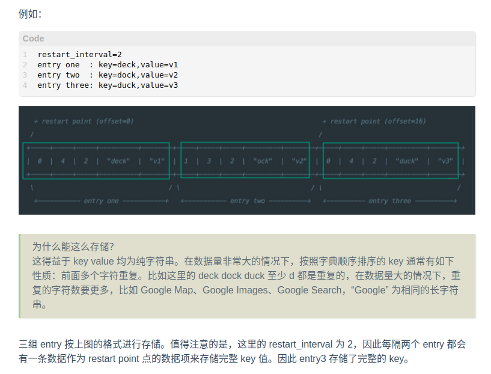

    此外，第一个restart point为0（偏移量），第二个restart point为16,restart point共有两个，因此一个datablock
    数据段的末尾添加了下图所示的数据：


    尾部数据记录了每一个restart point 的值，以及所有的restart point个数。

4、filter block的数据结构：
    
    为了加快SSTable中数据查询的效率，在直接查询datablock中的内容之前，levelBD首先根据filter block
    中的过滤数据信息判断指定的data block中是都有需要查询的数据，若判断不存在，则无需对这个data block
    进行数据查询。
    
    filter block 存储的是data block数据的一些过滤信息，这些过滤数据一般指代布隆过滤器的数据，用于加
    快查询的速度。

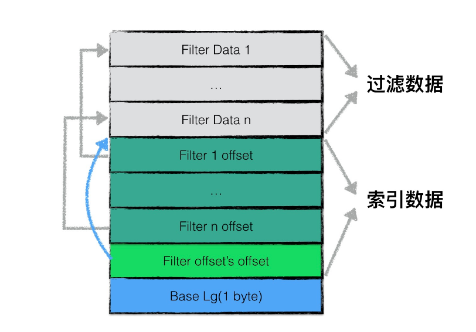

    filter block 存储的数据主要分为两部分：
        1、过滤数据
        2、索引数据

    其中索引数据中，filter i offset 表示第 i 个 filter data 在整个 filter block 中的起始偏移量，
    filter offset's offset 表示 filter block 的索引数据在 filter block 中的偏移量。
    在读取 filter block 中的内容时，可以首先读出 filter offset's offset 的值，然后依次读取 filter
    i offset，根据这些 offset 分别读出 filter data。
    Base Lg 默认值为 11，表示每 2KB 的数据，创建一个新的过滤器来存放过滤数据。

    一个 SSTable 只有一个 filter block，其内存储了所有 block 的 filter 数据。具体来说，filter_data_k 
    包含了所有起始位置处于 [base*k, base*(k+1)] 范围内的 block 的 key 的集合的 filter 数据，按数据大小
    而非 block 切分主要是为了尽量均匀，以应对存在一些 block 的 key 很多，另一些 block 的 key 很少的情况。

5、meta index block数据结构

    用来存储filter block在整个SSTable中的索引信息
    meta index block只存储一条记录：
        key：filter. + 过滤器名字组成的常量字符串；
        value：filter block 在SSTable中索引信息序列化后的内容，索引信息包括：
                在SSTable中的偏移量
                数据长度

6、index block

    与meta index block类似：index block 用来存储所有的data block 的相关信息
    index block包含若干条记录，每一条记录代表一个data block的索引信息
    一条索引包括以下内容：
        6.1、data block i中最大的key
        6.2、该data block起始地址在sstable中的偏移量
        6.3、该data block的大小
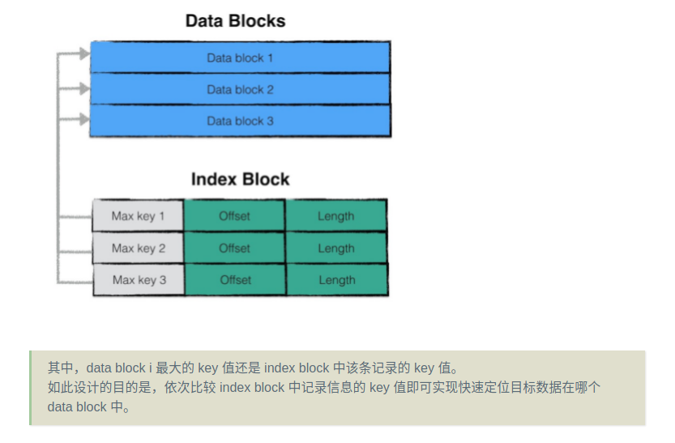

7、footer数据结构

    footer 大小固定，为 48 字节，用来存储 meta index block 与 index block 在 SSTable 中的索引信息，另外尾部还会存储一个 magic word，
    内容为：“http://code.google.com/p/leveldb/" 字符串 sha1 哈希的前 8 个字节。

8、写操作

    8.1、sstable的写操作通常发生在：

        1、memory db将内容持久化到磁盘文件中时，会创建一个sstable进行写入
        2、leveldb后台进行文件compaction时，会将若干个sstable文件内容重新组织，输出到若干个新的sstable中；

    为sstable进行写操作的数据结构为tWriter，具体如下：
```
    // tWriter wraps the table writer. It keep track of file descriptor
    // and added key range.
    type tWriter struct {
        t *tOps
    
        fd storage.FileDesc // 文件描述符
        w  storage.Writer   // 文件系统writer
        tw *table.Writer
    
        first, last []byte
    }
```
    主要包括了一个sstable的文件描述符，底层文件系统的writer，该sstable中所有数据项最大最小的key值以及一个内嵌的tableWriter。

    一次sstable的写入为一次不断利用迭代器读取需要写入的数据，并不断调用tableWriter的Append函数，直至所有有效数据读取完毕，为该
    sstable文件附上元数据的过程。
    该迭代器可以是一个内存数据库的迭代器，写入情景对应着上述的第一种情况；
    该迭代器也可以是一个sstable文件的迭代器，写入情景对应着上述的第二种情况；

    8.2、！！！tableWriter的Append函数是理解整个写入过程的关键

        tableWriter struct：

```
    // Writer is a table writer.
    type Writer struct {
        writer io.Writer
        // Options
        blockSize   int // 默认是4KiB
    
        dataBlock   blockWriter // data块Writer
        indexBlock  blockWriter // indexBlock块Writer
        filterBlock filterWriter // filter块Writer
        pendingBH   blockHandle
        offset      uint64
        nEntries    int // key-value键值对个数
    }
```
    
    其中blockWriter与filterWriter表示底层的两种不同的writer，blockWriter负责写入data数据的写入，而filterWriter负责写入过滤数据。

    pendingBH记录了上一个dataBlock的索引信息，当下一个dataBlock的数据开始写入时，将该索引信息写入indexBlock中。

    8.3、Append
    
        Append的主要逻辑：
            1、若本次写入为新dataBlock的第一次写入，则将上一个dataBlock的索引信息写入；
            2、将keyvalue数据写入datablock；
            3、将过滤信息写入filterBlock；
            4、若datablock中数据超过预订上限，则标志着本次datablock写入结束，将内容刷新到磁盘文件中；

```
    func (w *Writer) Append(key, value []byte) error {
        w.flushPendingBH(key)
        // Append key/value pair to the data block.
        w.dataBlock.append(key, value)
        // Add key to the filter block.
        w.filterBlock.add(key)
    
        // Finish the data block if block size target reached.
        if w.dataBlock.bytesLen() >= w.blockSize {
            if err := w.finishBlock(); err != nil {
                w.err = err
                return w.err
            }
        }
        w.nEntries++
        return nil
    }
```
    dataBlock.append
        该函数将编码后的KV数据写入到dataBlock对应的buffer中，编码的格式如上稳重提到的数据项的格式，此外，在写入的过程中，若该数据项为restart
        点，则会添加响应的restart point信息。

    filterBlock.append
        该函数将KV数据项的key值加入到过滤信息中。

    finishBlock
        若一个datablock中的数据超过了固定上限，则需要将相关数据写入到磁盘文件中。
        
        在写入时，需要做以下工作：

        封装dataBlock，记录restart point的个数；
        若dataBlock的数据需要进行压缩（例如snappy压缩算法），则对dataBlock中的数据进行压缩；
        计算checksum；
        封装dataBlock索引信息（offset，length）；
        将datablock的buffer中的数据写入磁盘文件；
        利用这段时间里维护的过滤信息生成过滤数据，放入filterBlock对用的buffer中；
    
    Close
        当迭代器取出所有数据并完成写入后，调用tableWriter的Close函数完成最后的收尾工作：

        若buffer中仍有未写入的数据，封装成一个datablock写入；
        将filterBlock的内容写入磁盘文件；
        将filterBlock的索引信息写入metaIndexBlock中，写入到磁盘文件；
        写入indexBlock的数据；
        写入footer数据；
        至此为止，所有的数据已经被写入到一个sstable中了，由于一个sstable是作为一个memory db或者Compaction的结果原子性落地的，因此在
        sstable写入完成之后，将进行更为复杂的leveldb的版本更新，

9、读操作
    
    读操作是写操作的逆过程：
        


    大致流程2为：
    
    1、首先判断“文件句柄”cache中是否有指定sstable文件的文件句柄，若存在，则直接使用cache中的句柄；否则打开该sstable文件，按规则读取该文件的
        元数据，将新打开的句柄存储至cache中；
    2、利用sstable中的index block进行快速的数据项位置定位，得到该数据项有可能存在的两个data block；
    3、利用index block中的索引信息，首先打开第一个可能的data block；
    4、利用filter block中的过滤信息，判断指定的数据项是否存在于该data block中，若存在，则创建一个迭代器对data block中的数据进行迭代遍历，
        寻找数据项；若不存在，则结束该data block的查找；
    5、若在第一个data block中找到了目标数据，则返回结果；若未查找成功，则打开第二个data block，重复步骤4；
    6、若在第二个data block中找到了目标数据，则返回结果；若未查找成功，则返回Not Found错误信息；

    缓存：
        在levelDB中，使用cache来缓存两类数据：
            1、sstable文件句柄及其元数据；
            2、data block中的数据；

    因此在打开文件之前，首先判断能够在cache中命中sstable的文件句柄，避免重复读取的开销

    元数据的读取：


        
    由于sstable负责的文件组织格式，因此在打开文件后，需要读取必要的元数据，才能访问sstable中的数据。
    
    元数据读取的过程可以分为以下几个步骤：
        1、读取文件的最后48字节的利用，即footer数据；
        2、读取footer数据中维护的两个数据项：（1）meta index block；（2）index block两个部分的的索引信息并记录；
        3、利用meta index block的索引信息读取该部分的内容；
        4、遍历meta index block，查看是否存在“有用”的filter block的索引信息，若有，则记录该索引信息；若没有，则表示当前sstable
            中不存在任何过滤信息来提高效率。
    

    数据项的快速定位：
        sstable中存在多个data block，倘若依次进行“遍历”，显然是不可取的，但是由于一个sstable钟所有的数据项都是按序排列的，因此可以
        利用有序性已经index block中维护的索引信息快速定位目标数据项可能存在的data block。

        一个index block的文件结构示意图如下：


        index block是由一系列的键值对组成，每一个键值对表示一个data block的索引信息。

        键值对的key为该data block中数据项key的最大值，value为该data block的索引信息（offset, length）。

        因此若需要查找目标数据项，仅仅需要依次比较index block中的这些索引信息，倘若目标数据项的key大于某个data block中最大的key值，
        则该data block中必然不存在目标数据项。故通过这个步骤的优化，可以直接确定目标数据项落在哪个data block的范围区间内。
        
        !!!值得注意的是，与data block一样，index block中的索引信息同样也进行了key值截取，即第二个索引信息的key并不是存储完整的key，
        而是存储与前一个索引信息的key不共享的部分，区别在于data block中这种范围的划分粒度为16，而index block中为2 。

        也就是说，index block连续两条索引信息会被作为一个最小的“比较单元“，在查找的过程中，若第一个索引信息的key小于目标数据项的key，
        则紧接着会比较第三条索引信息的key。

        这就导致最终目标数据项的范围区间为某”两个“data block。


        
    过滤data block

        若sstable存有每一个data block的过滤数据，则可以利用这些过滤数据对data block中的内容进行判断，“确定”目标数据是否存在于data block中。
        
        过滤的原理为：
        
        若过滤数据显示目标数据不存在于data block中，则目标数据一定不存在于data block中；
        若过滤数据显示目标数据存在于data block中，则目标数据可能存在于data block中；
        具体的原理可能参见《布隆过滤器》。
        
        因此利用过滤数据可以过滤掉部分data block，避免发生无谓的查找。

    查找data block


        在data block中查找目标数据项是一个简单的迭代遍历过程。虽然data block中所有数据项都是按序排序的，但是作者并没有采用“二分查找”来提高查
        找的效率，而是使用了更大的查找单元进行快速定位。

        与index block的查找类似，data block中，以16条记录为一个查找单元，若entry 1的key小于目标数据项的key，则下一条比较的是entry 17。

        因此查找的过程中，利用更大的查找单元快速定位目标数据项可能存在于哪个区间内，之后依次比较判断其是否存在与data block中。

        可以看到，sstable很多文件格式设计（例如restart point， index block，filter block，max key）在查找的过程中，都极大地提升了整体
        的查找效率。


10、SSTable的IO方式-log structured-merge tree（算法）

简介：

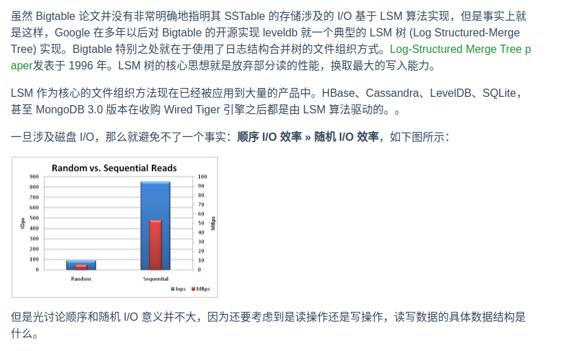

读写矛盾、以及日志系统的优化：

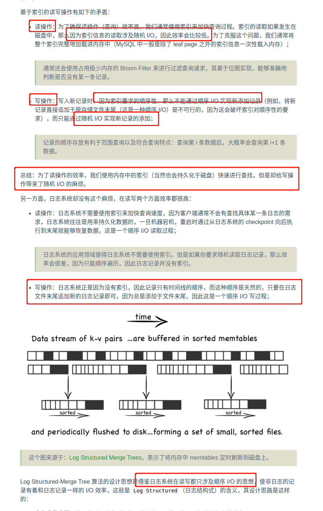

操作：


合并的逻辑：

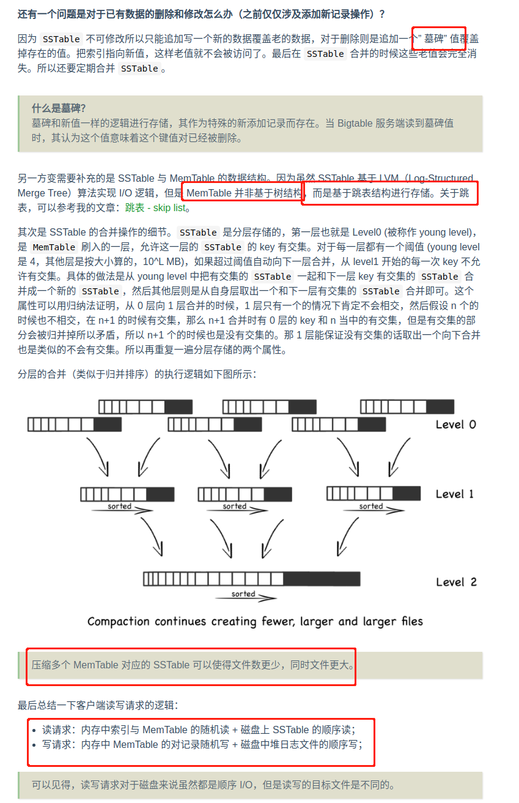

数据结构的对比：


---
## Bigtable的得与失

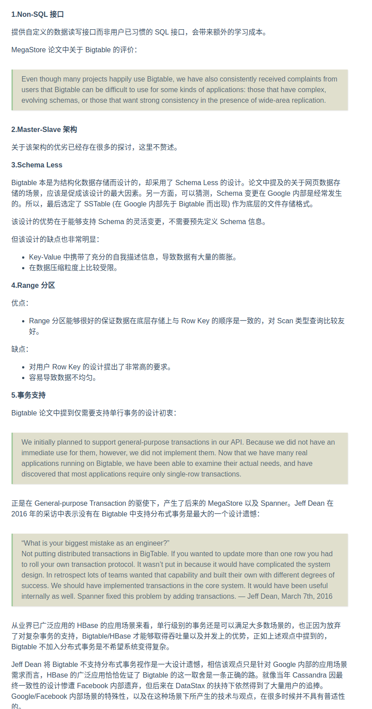

趋势：计算与存储分离


